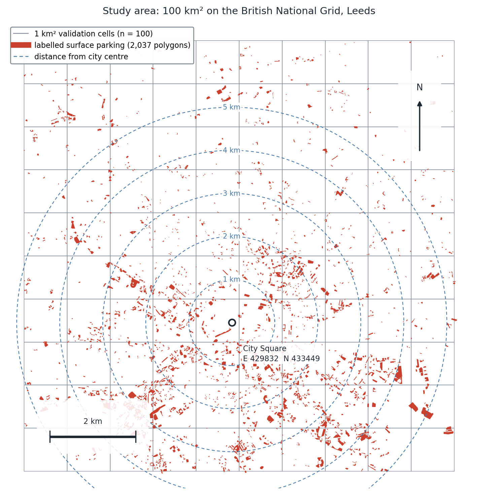
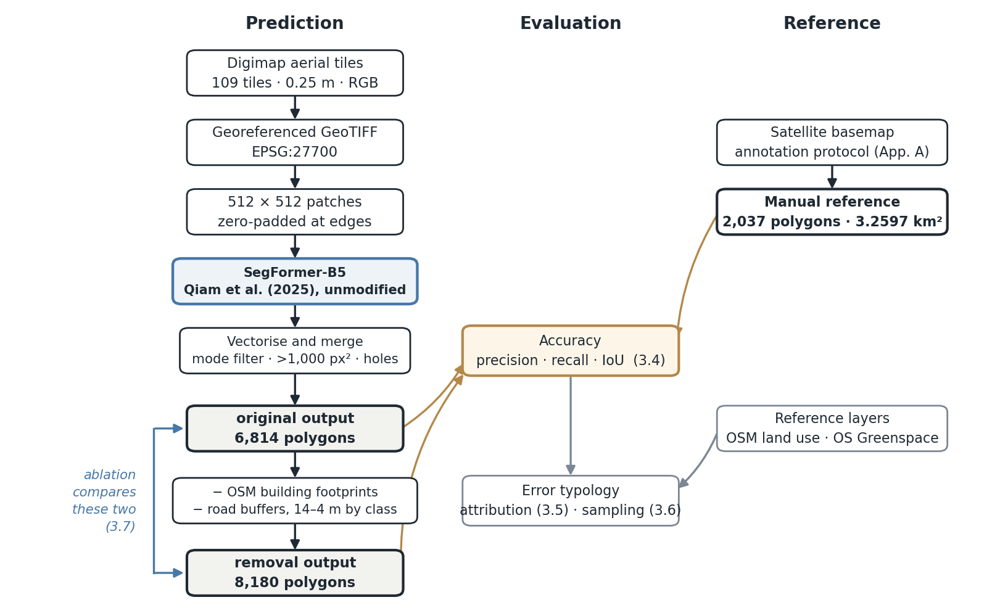

# 3. Methodology

> **草稿 v2**｜正文约 2,950 词（方法章允许适度超，见 Slater 先例）
> 图：`figures/` 下两张已生成｜表 3.1–3.3 已排｜公式已改 LaTeX
> 待办：引用格式统一；标注规程全文进 Appendix A

---

This chapter sets out how the transfer was tested. It describes the study area and the imagery the model consumed (3.1), the annotation protocol used to build an independent reference (3.2), the segmentation pipeline itself (3.3), and the accuracy measures (3.4). It then sets out the two complementary procedures used to characterise error — automated attribution against reference layers (3.5) and stratified sampling with visual adjudication (3.6) — followed by the ablation design used to isolate the contribution of post-processing (3.7). Two checks close the chapter: one on the imagery underlying the reference and the predictions (3.8), and one on the estimator used to correct the model's systematic bias (3.9).

---

## 3.1 Study area and data

The study area is a 100 km² square centred on Leeds, divided into one hundred 1 km² cells on the British National Grid (Figure 3.1). The city centre is taken as City Square (E 429832, N 433449); cell centroids lie between 0.34 km and 7.64 km from it. Leeds was chosen as a large English city outside London with substantial surface parking in and around its core, and with complete aerial coverage at the resolution the model requires. A square grid rather than an administrative boundary was used so that every cell is an equal-area unit and per-cell statistics are directly comparable. The choice of areal unit is not neutral — figures computed over zones depend on how the zones are drawn, the modifiable areal unit problem (Openshaw, 1984) — so the unit is held constant throughout and whole-area figures are reported alongside per-cell ones.

**Figure 3.1** The study area: one hundred 1 km² validation cells on the British National Grid, the 2,037 manually labelled surface parking polygons, and distance rings from City Square. Labelled parking is visibly concentrated in a band around, rather than at, the centre — a pattern quantified in 4.7.

The imagery is Getmapping aerial photography supplied through Digimap: 109 tiles at 0.25 m ground sample distance, three visible bands (RGB), projected in EPSG:27700. The tiles carry three version suffixes — `_03` (79 tiles), `_04` (20) and `_05` (10) — reflecting different processing runs. All spatial operations are carried out in EPSG:27700, whose units are metres, so polygon areas are read directly in m² without further projection.

Three reference datasets are used, none of them as ground truth. OpenStreetMap building footprints and road centrelines (retrieved 25 June 2026) are inputs to the post-processing stage. OpenStreetMap land use, brownfield, pitch and `amenity=parking` polygons are used only to attribute errors after the fact. Ordnance Survey Open Greenspace supplies sports facilities. The distinction matters: reference layers are used here to explain where errors fall, and — with the deliberate exception tested in 3.7 — never to decide what the map should contain.

---

## 3.2 Annotation protocol

Accuracy figures are only meaningful against a reference that follows the definition the model was trained on. The annotation rules therefore follow those of Qiam, Devunuri and Lehe (2025), whose dataset the model was trained on, and are reproduced in full in Appendix A. The target is off-street surface parking: open-air, ground-level areas used for parking, outside the public road. Labels are binary. No minimum size threshold is applied. Marked bays and the aisles connecting them are included, as is rooftop parking where the parking surface is visible from above; on-street parking and enclosed multi-storey structures are excluded. Where markings are absent, an area is labelled only where parked vehicles and a bay-and-aisle layout together make the use unambiguous. Boundaries are drawn at the edge of the paving rather than the parcel line.

One boundary inside residential parking is worth stating explicitly, because it is the commonest ambiguous case in a British city. Parking courts shared between several dwellings are labelled; driveways and forecourts serving a single household are not. A communal court resembles a small car park in layout and in what it does, while a single driveway does not. The distinction is not introduced here: UK parking measurement already separates private residential parking into driveway and communal categories, and the two were surveyed and reported separately in the London study described in §2.2 (Bates and Leibling, 2012).

Labelling was carried out in QGIS by a single annotator over a satellite basemap, producing 2,037 polygons with a confidence attribute (3 = clear, 2 = fairly clear, 1 = uncertain) and a free-text note used to flag rooftop cases. Summed individually the polygons cover 3.2677 km². Dissolving them leaves both the area and the part count unchanged, so no two labelled polygons overlap; the reference is nonetheless dissolved before every comparison, since the accuracy measures of 3.4 are only well defined on non-overlapping geometry and the property should be enforced rather than assumed. Clipping to the study grid removes 0.0081 km² where polygons cross the outer boundary, giving the **3.2597 km²** used throughout. One cell (c0r9) contains no labelled parking, so recall is undefined there and per-cell statistics involving recall use $n = 99$.

Single-annotator labelling is a limitation with a measurable consequence rather than a generic caveat. Detection rates fall systematically with annotator confidence (4.3), so the reference itself places a ceiling on measurable accuracy; this is quantified in the results and returned to in the discussion.

---

## 3.3 Model and pipeline

The model is the SegFormer (Xie et al., 2021) parking-lot segmentation network released by Qiam, Devunuri and Lehe (2025), a B5 configuration whose backbone was initialised from Cityscapes weights and fine-tuned by those authors on their parking dataset. The published checkpoint is used exactly as released. **No UK imagery was used to adjust the weights**, so what is measured here is zero-shot transfer: the accuracy a UK user would obtain by taking the model off the shelf.

**Figure 3.2** The processing chain. Prediction runs from Digimap tile to two outputs — before and after post-processing — which the ablation of 3.7 compares against each other. The manual reference and the model outputs meet at the accuracy measures of 3.4; the reference layers enter only at the error-attribution stage of 3.5–3.6.

The pipeline proceeds in five stages. Digimap tiles and their world files are converted to georeferenced GeoTIFFs. Each tile is cut into 512 × 512 pixel patches, zero-padded at the edges. Patches are passed through the network and the upsampled logits reduced to a binary mask by argmax. Masks are cleaned with a mode filter and vectorised by contour extraction, with components below 1,000 px² (about 62 m² at 0.25 m) discarded and enclosed holes subtracted; polygons are then transformed from pixel to grid coordinates and merged across tiles.

Two post-processing subtractions follow, both UK-specific. OpenStreetMap building footprints are subtracted, on the reasoning that a roof cannot be surface parking. Road centrelines are buffered by carriageway class (Table 3.1), dissolved, and subtracted.

**Table 3.1** Road buffer half-widths by OSM `highway` class. Where a `lanes` tag is present, the width is the greater of the tabulated value and 3 m per lane.

| Class | Width (m) | | Class | Width (m) |
|---|---:|---|---|---:|
| motorway | 14 | | tertiary | 7 |
| trunk | 12 | | tertiary_link | 5 |
| primary | 10 | | unclassified | 5 |
| secondary | 8 | | residential | 5 |
| motorway_link | 9 | | living_street | 4 |
| trunk_link | 8 | | *default* | *5* |
| primary_link | 7 | | | |
| secondary_link | 6 | | | |

Footways, cycleways, bridleways, tracks, steps, pedestrian ways and **service roads** are excluded from the road layer, service roads in particular because they commonly run *through* car parks; buffering them would remove the aisles the protocol explicitly includes. Both subtractions are evaluated rather than assumed in 3.7.

The output before subtraction (6,814 polygons) and after (8,180 polygons) are both retained. The increase in count reflects single lots being split by the subtracted geometry, which is why polygon counts are never interpreted as numbers of car parks.

---

## 3.4 Validation design

Accuracy is measured by area rather than by object, following the general practice in land-cover accuracy assessment of comparing a map against an independent reference over a defined spatial support (Foody, 2002; Olofsson et al., 2014). Let $M$ and $R$ denote the dissolved model and reference geometry, and $|\cdot|$ denote area in m². Dissolving before comparison ensures overlapping geometry is not double-counted. The three quantities are then set operations:

$$
\mathrm{TP} = M \cap R, \qquad \mathrm{FP} = M \setminus R, \qquad \mathrm{FN} = R \setminus M
$$

from which

$$
\text{precision} = \frac{|\mathrm{TP}|}{|\mathrm{TP}| + |\mathrm{FP}|}, \qquad
\text{recall} = \frac{|\mathrm{TP}|}{|\mathrm{TP}| + |\mathrm{FN}|}, \qquad
\text{IoU} = \frac{|\mathrm{TP}|}{|\mathrm{TP}| + |\mathrm{FP}| + |\mathrm{FN}|}
$$

Area-based measures were chosen over object-based matching because the question is how much land the map assigns to parking, and because object matching would require an arbitrary rule for when a split or merged polygon counts as the same lot — a rule the post-processing stage makes particularly unstable. The unit on which accuracy is assessed is itself a design decision rather than a given, and one that governs what the resulting figures mean (Stehman and Foody, 2019). As an internal check, $|M| = |\mathrm{TP}| + |\mathrm{FP}|$ and $|R| = |\mathrm{TP}| + |\mathrm{FN}|$; both hold to four decimal places.

Two aggregations over the $n$ cells are reported. Writing $\mathrm{TP}_c$ for the true positive area within cell $c$, the **micro** (area-weighted) and **macro** (cell-averaged) forms of precision are

$$
p_{\text{micro}} = \frac{\sum_c |\mathrm{TP}_c|}{\sum_c\left(|\mathrm{TP}_c| + |\mathrm{FP}_c|\right)},
\qquad
p_{\text{macro}} = \frac{1}{n}\sum_c \frac{|\mathrm{TP}_c|}{|\mathrm{TP}_c| + |\mathrm{FP}_c|}
$$

and recall and IoU follow the same pattern. The micro figure treats the whole study area as one unit, so large car parks carry proportionate weight; it answers whether the *total area* is right. The macro figure weights every cell equally regardless of how much parking it contains. The two are reported side by side because the difference between them is itself informative: where macro falls below micro, the model is performing worse in cells with little parking than the area-weighted figure suggests.

---

## 3.5 Error typology I: automated attribution

The first characterisation of error asks where FP and FN area falls relative to independent layers. It is applied exhaustively to all of it.

**Boundary effects are separated first.** An area-based measure treats segmentation as pixel-level classification and returns a single figure in which a car park drawn slightly too wide and a car park invented in the wrong place are indistinguishable (Csurka, Larlus and Perronnin, 2013). The segmentation literature's response has been to evaluate within a band of fixed distance from the contour: Boundary IoU computes overlap only over pixels lying within a specified distance of the boundary, recovering a sensitivity to boundary error that mask IoU loses — particularly for large objects, whose interiors dominate the score (Cheng et al., 2021). The construction used here is of that family but serves a different purpose. Rather than producing a boundary-aware score, it partitions the error, so that the boundary component and the remainder can be reported separately and attributed to different causes.

FP area within a fixed distance $d$ of a labelled lot is boundary *dilation* — the model drawing the same car park slightly too large — as distinct from a standalone false detection elsewhere. Symmetrically, FN area within $d$ of a predicted area is *erosion*: reference area the model did not cover, but lying immediately alongside something it did find.

$$
\mathrm{FP}_{\text{dilation}}(d) = \mathrm{FP} \cap \big(R \oplus d\big), \qquad
\mathrm{FN}_{\text{erosion}}(d) = \mathrm{FN} \cap \big(M \oplus d\big)
$$

where $\oplus$ denotes dilation by a buffer of $d$ metres. Erosion is defined against the *prediction* rather than against the reference boundary, so that it captures only reference area adjacent to a detection; defining it against the reference boundary would also count the outer edge of lots the model missed entirely, which is a detection failure rather than a boundary effect. Because no threshold separates the two cleanly, results are reported at $d = 2$, 5 and 10 m, with 5 m used as the working value. Sensitivity to the width chosen is a known property of band-based measures rather than a peculiarity of this application (Cheng et al., 2021), which is why three are given. That 5 m is a convention rather than a natural break is also visible in the sampled evidence: the sampled FP fragments that no category explained sit at a median distance of exactly 5.0 m from the nearest labelled lot, against 42–169 m for every substantive category (4.6).

**Standalone FP is then attributed in two ways, reported side by side.**

- An **exclusive partition**: reference layers $L_1,\dots,L_k$ are peeled off in sequence, each claiming only the area not already claimed, so shares sum to 100%. Layers are ordered by how precisely they locate the phenomenon — building footprints and sports pitches, which are exact polygons, before road proximity buffers, before broad land-use classes — with industrial and commercial land last because it is the least specific evidence.
- An **unordered overlap**: each layer is intersected with all FP independently, $\mathrm{FP} \cap L_j$, so categories may overlap one another and need not sum to 100%.

Presenting both means the substantive conclusions do not depend on an ordering decision I made; as a robustness check, moving industrial land from an early position to last changes its exclusive share from 30.0% to 29.6%. **The two have different denominators and are not differences of one another** — a point carried into the results tables, where the exclusive column includes the dilation band as its first row so that it sums to 100%.

**FN is defined at the level of the car park, not the fragment.** An earlier version defined missed parking as reference area more than 5 m from any prediction, which conflated genuinely undetected car parks with the ragged edges of ones the model had largely found. Two diagnostics showed this: of 297 such fragments, 221 lay at a distance of exactly 5.0 m — the threshold itself — and 19.2% of the area belonged to lots the model had detected to better than 70%. FN is therefore partitioned by the *coverage* of the lot it belongs to, $\gamma = |R_i \cap M| / |R_i|$:

| Class | Coverage | Treatment |
|---|---|---|
| whole lot missed | $\gamma \le 0.10$ | a detection failure |
| partly detected | $0.10 < \gamma \le 0.70$ | partial failure |
| fringe of detected lot | $\gamma > 0.70$ | boundary imprecision |

Only the first is treated as a detection failure, and is further attributed to post-processing removal, rooftop labelling, containment within OSM buildings, or genuine non-detection.

Throughout, attribution is positional and is worded as such. A false positive lying on OSM industrial land is reported as *located on* industrial land; it is not a claim that each such polygon was individually confirmed to be a storage yard.

---

## 3.6 Error typology II: stratified sampling

Automated attribution leaves a residual in each direction that no reference layer explains. These residuals are characterised by stratified random sampling with visual adjudication (Table 3.2). The design follows the three-part structure recommended for accuracy assessment — a sampling design, a response design specifying how each sampled unit is judged, and an analysis that scales the sample back to the population (Olofsson et al., 2014; Stehman and Foody, 2019).

**Table 3.2** Sampling design. Large polygons are deliberately oversampled; the ratio estimator corrects for this.

| Population | Stratum (m²) | Polygons | Area (km²) | Sampled |
|---|---|---:|---:|---:|
| Unexplained FP | 100–300 | 604 | 0.1055 | 20 |
| | 300–1,000 | 327 | 0.1656 | 25 |
| | > 1,000 | 61 | 0.1172 | 25 |
| Whole lots missed | 100–300 | 34 | 0.0079 | 10 |
| | 300–1,000 | 51 | 0.0292 | 15 |
| | > 1,000 | 17 | 0.0377 | 17 |
| OSM-only parking | 100–300 | 97 | 0.0192 | 5 |
| | 300–1,000 | 117 | 0.0625 | 10 |
| | > 1,000 | 59 | 0.1793 | 15 |
| **Total** | | | | **142** |

Estimates use a stratified ratio estimator (Cochran, 1977). For stratum $h$ of known total area $A_h$, with sample $s_h$ and polygon areas $a_i$, the estimated area of category $c$ is

$$
\hat{A}_c = \sum_h A_h \cdot \frac{\sum_{i \in s_h,\, i \in c} a_i}{\sum_{i \in s_h} a_i}
$$

so that oversampling of large polygons does not distort the totals.

The sampling frame excludes polygons below 100 m². For unexplained FP this removes 0.0513 km², or **11.7%** of that population (0.4396 km² in total, 0.3883 km² in frame). Percentages reported for this population are therefore shares of the frame, and the corrections derived from them (4.6) implicitly assume the excluded slivers have the same composition as the sampled material. The assumption is conservative in the direction that matters: were the slivers composed like the sampled polygons, the upward correction to precision would be *larger* than the one reported. Slivers below 100 m² are in any case more plausibly boundary artefacts than real parking, so they are not extrapolated to.

Each sample was inspected as an image chip cut from the Digimap tiles and assigned one category from a fixed list, with an optional note. **Adjudication was carried out against the Digimap imagery**, since a model's failure can only be assessed against the imagery it was given. Categories are organised by failure *mechanism* rather than surface appearance — what visual cue was absent — so that the typology maps onto plausible causes rather than onto descriptions.

---

## 3.7 Ablation design

The contribution of each post-processing subtraction is measured by a $2 \times 2$ factorial design: the raw prediction, buildings removed only, roads removed only, and both. Because set difference is commutative in the relevant sense,

$$
(X \setminus A) \setminus B = X \setminus (A \cup B)
$$

order does not affect this design; order matters only for the exclusive partition of 3.5. As a check that the reconstruction is faithful, applying both subtractions in one operation is compared against the pipeline's own tile-by-tile output; the two agree to within 0.0% on all three measures, so the ablation can be trusted to isolate what it claims to.

A second set of variants tests the reference layers as **filters** rather than as explanations. Sports pitches, industrial and commercial land, and road buffers widened by a further 6 m are each subtracted from the finished map, singly and together. This is a deliberate test of a tempting inference: a layer that explains where errors fall might be assumed to improve the map if used to remove them. Reporting recall alongside precision for these variants is what makes the test informative.

Rooftop parking is examined separately as a case where the pipeline and the model can be shown to disagree. The sixteen labelled rooftop lots are compared against both the pre-subtraction and post-subtraction outputs.

---

## 3.8 Consistency of the two imagery sources

Labelling was carried out over a satellite basemap, whereas the model operated on Digimap aerial tiles. Because these are different sources, any difference between them could in principle contribute to the measured error rather than the model. Three independent checks bound and quantify that contribution.

**(i) Spatial alignment.** For the 1,478 labelled lots the model detected to better than 70% and larger than 300 m², let $\mathbf{d}_i$ be the vector from the centroid of the labelled polygon to the centroid of the intersecting prediction. A registration offset displaces every lot in the same direction, so the mean *vector* is large; imprecise boundaries displace lots in varying directions, so the mean vector stays small while individual displacements do not. The two are separated by

$$
\rho = \frac{\left\lVert \bar{\mathbf{d}} \right\rVert}{\frac{1}{n}\sum_i \lVert \mathbf{d}_i \rVert},
\qquad \bar{\mathbf{d}} = \frac{1}{n}\sum_i \mathbf{d}_i
$$

with $\rho \to 0$ where the shared component is negligible relative to the scatter, and $\rho \to 1$ under a uniform shift. Here $\lVert\bar{\mathbf{d}}\rVert = 0.208$ m — **0.83 of one 0.25 m pixel** — against a mean absolute displacement of 1.247 m (4.99 px), giving $\rho = 0.167$. A shared component is statistically detectable (both axes significant at $p < 0.001$; sector directions non-uniform, $\chi^2 = 169.2$, $p < 0.001$), but with 1,478 lots a sub-pixel bias is detectable without being practically meaningful: the significance here is a function of sample size, not of magnitude. The two sources are co-registered to well within a pixel, and the boundary error reported in the results is attributable to the model.

**(ii) A logical upper bound on temporal mismatch.** A model cannot partially detect a car park absent from its input imagery. Every lot detected even in part therefore demonstrably exists in the Digimap imagery, as does every lot the pre-subtraction output detected. Of the reference area the model misses, all but 0.0699 km² — **2.1% of labelled area** — belongs to such lots. Even were that entire residual imagery mismatch, recall would rise only from 0.854 to 0.873.

**(iii) A sampled estimate.** Within that residual, adjudication against the Digimap imagery estimates 0.0313 km², or **1.0% of labelled area**, as not parking in the imagery the model was given. Removing it raises recall from 0.854 to 0.863 and leaves precision unchanged.

A related check addresses whether OpenStreetMap disagreement can be attributed to that source being out of date. Last-edit timestamps were retrieved for all 985 OSM parking features in the study area. Since the polygons judged to show no parking on the ground are the *most* recently edited of any sampled category, the convenient explanation is not supported by the data. Because Digimap capture dates are not available, no claim about currency is made in either direction, and disagreements are described neutrally as areas where no parking is visible in the imagery used here. The timestamp records any edit, including tag-only changes, and is not a construction date.

---

## 3.9 The calibration estimator and its spatial grain

Adjusting a mapped area using reference data is established practice: the area a map reports is biased by its own commission and omission error, and a reference sample provides the terms with which to correct it (Olofsson et al., 2014). The estimator used here is a simplified form of that idea, expressed through the two measures already reported. Where a map has precision $p$ and recall $r$, predicted area $|M|$ relates to true area $|R|$ by

$$
|M| \cdot p = |\mathrm{TP}| = |R| \cdot r
\qquad\Longrightarrow\qquad
|R| = |M| \cdot \frac{p}{r}
$$

Applied to the cells on which $p$ and $r$ were measured this is an identity and carries no information. It is also worth stating plainly that the factor reduces to an area ratio:

$$
\frac{p}{r} = \frac{|\mathrm{TP}|/|M|}{|\mathrm{TP}|/|R|} = \frac{|R|}{|M|}
$$

that is, the labelled area of the training cells divided by their predicted area. The estimator therefore requires only a labelled *total area* on a sample of cells, not a full object-level error analysis — which is what would make calibrating it in a second city affordable. Precision and recall are not redundant: they establish that the bias is systematic rather than noise, while what follows establishes the grain at which it holds.

The question that matters for use is whether a factor fitted on one part of the city predicts another part, and how finely it can be applied. Three hold-out schemes are used (Table 3.3), each fitting $p/r$ on a training set of cells $\mathcal{T}$ and applying it to held-out cells $\mathcal{H}$ the fit never saw. Whole cells are the unit held out rather than individual polygons: parking is spatially dependent at short range, and splitting dependent units at random is known to understate predictive error, so blocks are withheld instead (Roberts et al., 2017). Error is reported relative to the labelled area of the held-out set:

$$
e = \frac{\left(\sum_{c \in \mathcal{H}} |M_c|\right)\left(p/r\right)_{\mathcal{T}} - \sum_{c \in \mathcal{H}} |R_c|}{\sum_{c \in \mathcal{H}} |R_c|}
$$

**Table 3.3** Hold-out schemes for the calibration factor.

| Scheme | Held out | Tests | What it tests |
|---|---|---:|---|
| Random half split | 50 cells | 200 | transfer to a comparable area of the same city |
| Leave one distance band out | 1 band | 5 | transfer across the urban gradient |
| Leave one cell out | 1 cell | 99 | the finest grain the estimator could be used at |

Two implementation points. Per-cell true positives are recovered as $|\mathrm{TP}_c| = p_c \cdot |M_c|$, and $p$ and $r$ are then aggregated micro — as in 3.4 — since averaging per-cell precision directly would give the macro figure (0.5136 rather than 0.5708) and a mismatched factor. The cell with no labelled parking has no defined relative error and is excluded from the leave-one-out scheme, leaving 99. Relative error is unstable where a cell holds little parking, which inflates the leave-one-out mean above its median; a median absolute error in km² is therefore reported alongside.
