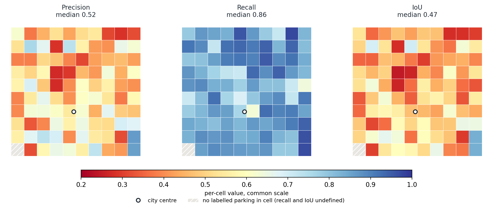
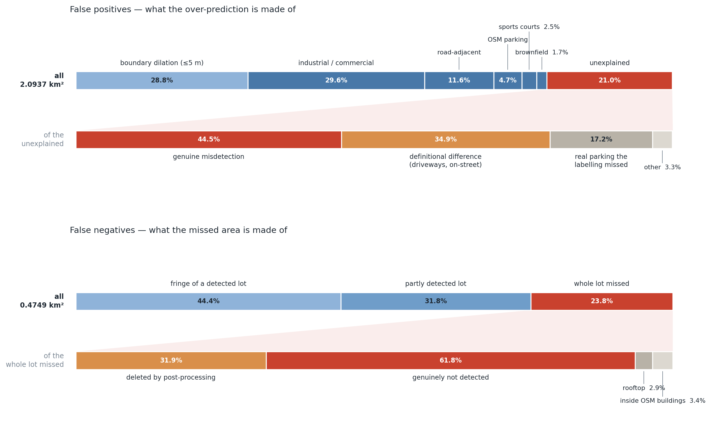
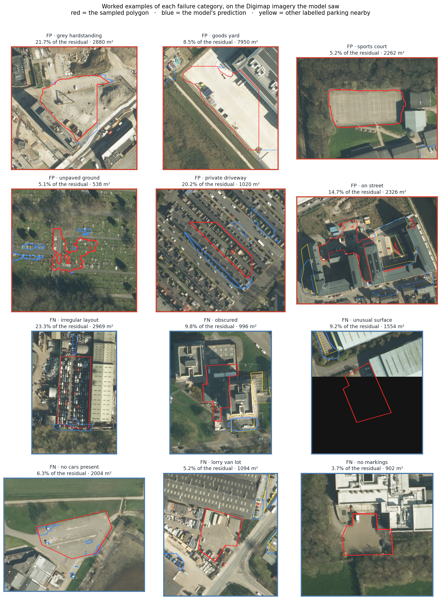
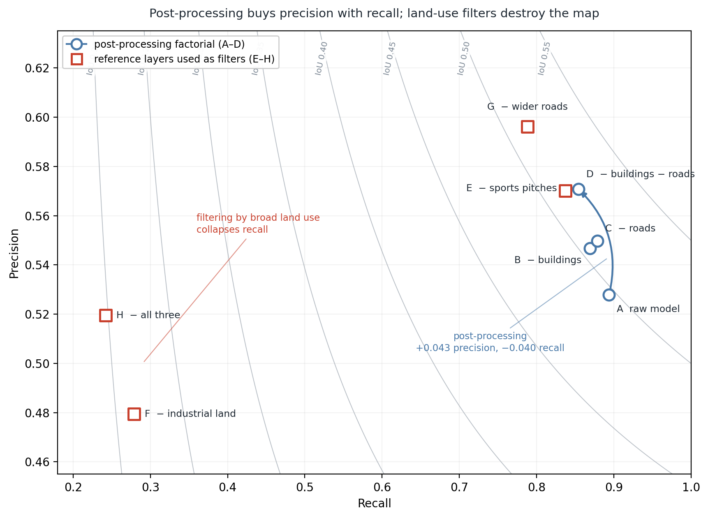
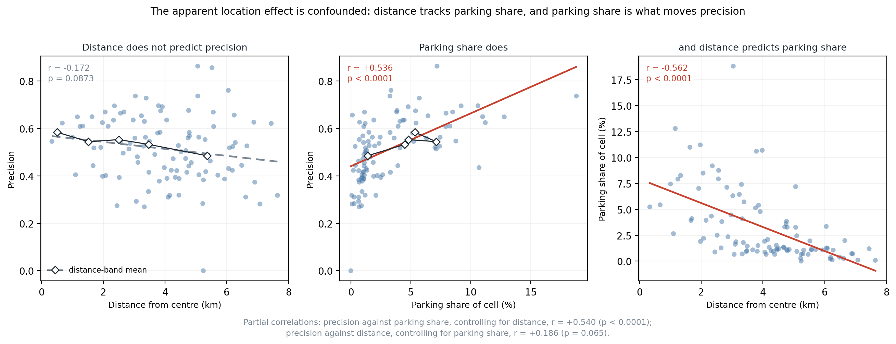
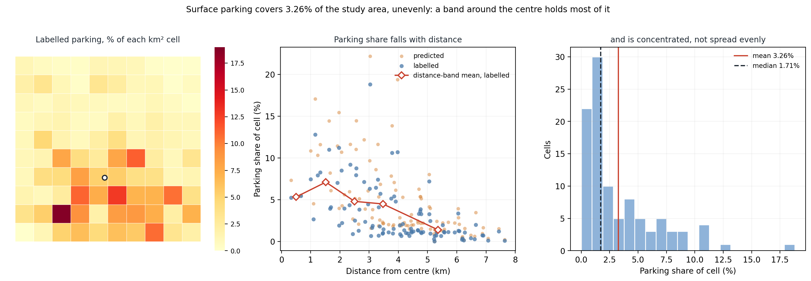
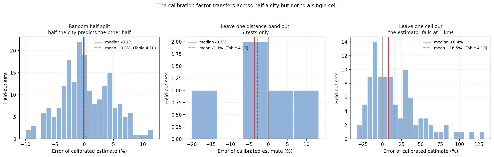

# 论文全文中文对照译稿

> 本文件翻译自 `00_abstract.md` 至 `06_conclusion.md` 的当前英文正文，仅供理解和校对论证使用。英文原稿未作改动。引文作者、年份、表号、图号、数字和公式均按原文保留。

---

# 摘要

英国目前没有统一的路外露天停车场空间记录。因此，停车场占用的土地一直缺席于城市密度提升的讨论，尽管国家规划政策已经明确将停车场列为地方政府应推动利用的低效用地之一。利用航空影像进行图像分割提供了一条不依赖政府记录、也不需要实地调查的路径；目前已经有专门为该任务训练并公开发布的模型，但它能否迁移到英国城市，尚未得到检验。

本论文将这一美国训练的模型完全按照公开版本、不使用任何英国训练数据，应用于利兹 100 km² 的区域，并用 2,037 个按照源模型目标定义人工标注的停车场进行评估。本研究不只报告准确率，还进一步分解误差：利用独立参考图层归因错误；通过对 142 个影像样本进行分层抽样，并依据模型实际使用的影像进行人工判读；同时通过消融实验检验后处理阶段的影响。

结果表明，模型迁移具有明显的不对称性。召回率为 **0.854**，且空间分布较为均匀；精确率为 **0.571**，预测面积是标注面积的 **1.50 倍**。误差主要来自边界划分，而不是无法识别停车场——真正的识别盲区最多只占标注面积的 2.1%。与此同时，后处理流程又制造了自己的盲区：原始模型识别屋顶停车场的能力甚至优于地面停车场，但后处理删除了其中五分之四。

在这一可靠性水平下，人工参考数据表明，露天停车场占研究区面积的 **3.26%**，主要集中在内侧 2 km 范围内，此后迅速下降。模型的高估具有系统性；在半个城市的尺度上，经校正后的误差可以控制在约 ±7%，但在单个 1 km² 网格尺度上不能做到这一点。一个迁移而来的地图无法单独测量一座城市有多少土地用于停车；但如果配合一次本地验证，它可以做到——这一结论与简单地接受或否定这张地图有本质区别。

---

# 1. 引言

## 1.1 背景与研究动机

露天停车场是少数几种几乎每座城市都大量拥有、却几乎没有城市真正统计过的土地用途之一。停车通常被视为一个交通问题——有多少车位、如何定价、何时使用——但它更重要的属性其实是空间性的。最低停车位配建要求，本质上是一条规定建筑必须留出多少土地用于停车的规则。因此，几十年累积下来，这些规定形成了一种土地利用格局：这些土地几乎不产生城市活动，也不提供住房，却从来没有任何机构负责系统地清点它们（Shoup, 2005）。

在英格兰，这一缺失如今变得越来越难以忽视。《国家规划政策框架》要求地方规划部门推动利用低效土地，并明确将停车场列为例子之一（MHCLG, 2024, para. 125(d)）。但这项要求预设了一个尚无人回答的问题：这些停车场在哪里，又占用了多少土地？城市密度提升研究也遇到了同样的障碍。研究发现，与欧洲同类城市相比，英国最大的城市存在显著的密度缺口，其中一部分由紧邻市中心之外的社区造成（Lange, Kovacevic and Johnson, 2026）；然而，目前并没有统一测量能够说明这些内城区土地中有多少正在被停车场占用。

这一空白并不是因为从未有人尝试，而是由既有停车测量方法造成的。美国拥有目前最完整的停车清单，但这些清单依赖地籍记录和编码明确的停车配建要求，而英国并没有可比形式的数据（Scharnhorst, 2018; Hoehne et al., 2019）。英国的测量则主要是地方性的实地调查——其中规模最大的是伦敦的地面抽样调查——而且统计的是*车位数量*，不是土地面积。英国近年来最重要的一份停车研究直言，关于停车设施究竟有多少，现实中几乎没有收集相关信息（Bates and Leibling, 2012）。

航空影像分割提供了一条绕开这两种障碍的路径，因为它既不依赖机构记录，也不需要实地调查。目前已经有一个专门识别停车场的模型公开发布，只要使用者拥有影像，就可以运行该模型（Qiam, Devunuri and Lehe, 2025）。对于英国城市的规划人员而言，这很有吸引力，而本论文检验的正是这一设想。

风险在于，模型可能无法良好迁移。在一个国家的影像和城市形态上训练的网络，应用到另一个国家时，表现可能完全不同。这个问题已经受到足够重视，以至于研究者专门建立了衡量这种差异的基准数据集（Maggiori et al., 2017; Lyu et al., 2025）。模型架构本身关于稳健性的声明也不能解决问题：SegFormer 所报告的零样本稳健性，是在熟悉城市的影像受到噪声、模糊等破坏时得到的，这几乎与本研究的情形相反（Xie et al., 2021）。在把迁移得到的地图用作土地证据之前，必须先确定它究竟可以用于什么。

最后这句话并不是提出了一个全新的问题，而是对应了一个已有的数据质量概念。空间数据质量通常被分为*内部质量*与*外部质量*：内部质量指数据与现实地表的吻合程度；外部质量或**用途适合性（fitness for use）**，则指数据是否足以支持某项具体用途。之所以需要这种区分，是因为同一数据集可能适合一种任务，却完全不适合另一种任务，因此数据质量不能脱离用途单独判断（Devillers et al., 2007）。本论文所做的是对迁移模型进行用途适合性评估，并把这种评估量化：问题不是这张地图笼统而言“好不好”，而是它已经测得的误差仍允许哪些用途。

## 1.2 研究问题

| | |
|---|---|
| **RQ1** | 一个在美国训练的露天停车场分割模型，在英国航空影像上的准确度如何？这种准确度是否在城市内部呈现系统性的空间差异？ |
| **RQ2** | 模型会产生哪些系统性错误？后处理消除了多少错误，又制造了多少错误？ |
| **RQ3** | 在已经测得的可靠性条件下，中心城区有多少土地属于露天停车场，它们集中在哪里？ |

这三个问题是依次推进的，而不是相互平行的。RQ1 首先确定模型迁移是否有效。RQ2 解释准确率数字为何呈现当前形态，并由此决定这些数字意味着什么。只有在前两个问题建立的可靠性条件下，RQ3 才能得到回答。

## 1.3 研究范围

本研究覆盖利兹 100 km² 的区域，并以 2,037 个手工标注的停车场进行验证。深入研究一座城市，而不是粗略比较多座城市，是一项主动的研究设计选择，不是研究缺陷。城市间比较预设模型输出值得信任，但这种可信度此前从未在英国得到验证。因此，本研究将有限的工作量用于建立人工参考、逐网格验证和抽样错误分类，在基于地图开展其他分析之前，先确定地图能够支持哪些用途。这样，多城市扩展就成为具有明确前提条件的未来研究；§4.7 对这一条件作了具体说明。

全文始终遵循三条边界。第一，研究目标是源模型所定义的路外露天停车场，因此路边停车和封闭式停车建筑按规则排除。第二，模型完全按照公开版本使用，不采用任何英国训练数据，因为本研究衡量的是普通使用者直接采用现成模型时会得到的结果。第三，本研究识别停车场的位置及其占地面积，但不判断任何具体地点是否应该重建。后者需要所有权、出入条件、停车需求和开发可行性等信息，而本研究使用的数据均不包含这些内容。

## 1.4 伦理考虑

本研究使用的全部数据都是二手数据，或者采用开放许可，或者由学校获得授权；研究不涉及任何人类参与者。尽管如此，仍有三个问题需要反思。首先，标注由一名标注者完成，因此人工参考包含个人对一个边界本身就存在模糊性的目标所作的判断。§4.3 对这项因素如何影响可测准确率进行了量化，而不是仅仅把它作为一般性限制。其次，人工参考是在卫星底图上绘制的，而模型使用的是另一套影像；这一差异在标注完成后才被发现，并在 §3.8 中作为一个范围有限、经过测量的影响明确报告，而不是被隐瞒。最后，一张识别低强度城市用地的地图可能被理解为开发机会清单。前述范围声明是一项实质性的承诺，而不是形式要求：下文不会作出任何具体地块层面的判断。

## 1.5 论文结构

第 2 章汇集四组通常彼此分离的文献：停车作为城市土地、停车规模的既有证据、航空影像分割，以及自愿地理信息作为参考数据的局限，并指出它们交汇处的研究空白。第 3 章介绍标注规则、处理流程、准确率指标、两条错误分类路径、消融实验设计，以及影像一致性和校准估计量的检验。第 4 章报告实测准确率、分解误差、检验后处理阶段、说明表面的区位效应受到混杂，并给出露天停车场的规模与分布。第 5 章回答三个研究问题，说明迁移地图能够和不能够支持什么，并讨论研究局限。第 6 章总结全文。

---

# 2. 背景

本章汇集四组很少被放在一起讨论的文献。§2.1 说明为什么值得测量露天停车场占用的土地，以及英国近期政策为何使这个问题更加紧迫。§2.2 回顾我们实际上知道多少停车规模信息，并说明既有证据及其背后的方法主要来自美国。§2.3 和 §2.4 转向可能填补这一空白的方法——航空影像语义分割，以及本研究使用的具体模型。§2.5 讨论模型跨越国界时可能出现什么问题，并把这些问题转化为结果章可以检验的一组预期。§2.6 解释为什么看似显然的替代参考 OpenStreetMap 不能充当地面真值。§2.7 最后明确研究空白。

## 2.1 停车作为城市土地

Shoup（2005）最有力地主张，应把停车视为土地利用问题，而不仅仅是交通问题。他认为，最低停车位配建要求是一种隐性补贴：无论实际需求如何，它都迫使开发者提供停车位，从而增加开发成本、鼓励驾车，并把土地长期固定在一种几乎不产生活动、也不提供住房的用途上。这个论点的力量来自空间层面。停车配建规定决定建筑必须留出多少土地，因此其累积结果是一种土地利用格局；但这种格局很少被系统统计，因为没有任何机构负责清点它。

这一视角如今与英格兰规划政策直接相关。《国家规划政策框架》要求地方政府“尽可能充分利用已经开发过的土地或‘棕地’”（MHCLG, 2024, para. 124），并在城镇内部对棕地开发给予高度重视。与本研究更直接相关的是第 125(d) 段，它要求地方政府：

> 促进并支持低效土地和建筑的开发，尤其是在土地供应受限、而现有地点能够得到更有效利用的情况下，如果这有助于满足已经确定的住房需求。例如，可以改造商店上方空间，或者在服务场地、**停车场**、车库和铁路基础设施之上或其所在地进行建设。

因此，国家政策明确把停车场列为低效土地的例子。可是，这项政策要求预设了一个尚无人回答的空间问题：停车场在哪里，又占用了多少土地？

城市密度提升文献中也存在同样的空白。Centre for Cities 的研究发现，与欧洲同类城市相比，曼彻斯特、伯明翰、利物浦、利兹和格拉斯哥等英国最大城市具有最大的密度缺口。这个缺口很大程度上由“紧邻市中心之外”的战后社区造成；与位置相似的战前社区相比，这些地区的密度最多可以低 40%（Lange, Kovacevic and Johnson, 2026）。Livingstone、Fiorentino 和 Short（2021）研究伦敦的密度提升政策如何在现实中实施及其代价；Habermehl 和 McFarlane（2025）则认为，密度不应被理解为一个需要单纯最大化的数值，而应理解为“强硬”与“温和”密度提升方式之间充满争议的辩证关系。这些研究都无法使用一项统一测量，说明英国城市内部有多少土地目前被露天停车场占用。政策要求找到低效土地，但证据基础甚至还不能说明其中有多少是停车场。

## 2.2 关于停车规模已有何种知识，这些知识来自哪里

系统性的停车清单确实存在，但绝大多数来自美国，而且建立这些清单的方法无法直接移植到英国。英国现有的证据测量的是不同事物，集中在一座不具代表性的城市，并且采用了成本高昂、难以重复的方法。

Scharnhorst（2018）结合卫星影像、税务和地籍记录，为纽约、费城、西雅图、得梅因和怀俄明州杰克逊五座美国城市建立了完整停车清单。无论从供应量还是使用状况看，结果都很突出：综合五座城市的占用率研究后，他报告称，空置车位占杰克逊住宅核心区供应量的 68%、中城区的 61%；得梅因一处大型公共设施中有 92% 的车位空置。费城市中心每英亩拥有超过 100 个停车位。Hoehne et al.（2019）采用另一种方法研究凤凰城都会区：他们将地籍和道路数据与最低停车位配建要求交叉对照，估计 2017 年该地区共有 1,220 万个停车位，而人口为 404 万、登记私人车辆为 286 万、工作岗位为 184 万；其中 1,090 万个车位是在 1960 年后增加的。

英国证据薄弱得多，而且研究者本人也承认这一点。Bates 和 Leibling（2012）为 RAC Foundation 完成的研究，是近年来英国停车政策最重要的综述。他们认为， coherent parking policy 面临的核心障碍就是数据缺失；研究表明，现实中关于停车空间数量的信息“少得惊人”（p. 99）。他们把问题归因于管理责任分散，以及地方政府缺乏审计停车供应的资源。英国已有的测量主要是地方性实地调查。规模最大的例子仍然是一项受托开展的伦敦研究：研究人员实地检查了 300 个 500 m 方格的样本，此后又对其中一部分进行复查，并估算伦敦约有 680 万个停车位。该研究统计的是车位数量（Bates and Leibling, 2012）。

这些证据的三个局限构成了本研究的切入点。第一，它统计的是**车位而不是土地面积**，因此无法回答一座城市究竟把多少地面用于停车。第二，它**集中在伦敦**，而伦敦在密度、土地价值和停车监管方面都不能代表其他英国城市。第三，它依赖**地面调查**，成本高到无法大规模重复，也没有扩展到其他城市。目前似乎不存在针对伦敦以外英国城市的、具有可比性的路外露天停车场*面积*测量。

这又带来两点结论。第一点是实质性的：凡是进行过统计的地方，停车供应都持续表现为明显超过实际使用量，因此停车占地是一个现实的土地问题，而不只是一个统计上的好奇现象。第二点是方法性的，也是本研究更重要的关注点。美国研究依赖的机构数据，在英国要么不存在可比形式，要么不包含同样的信息：Hoehne et al. 的方法需要与地块相连的法定最低停车要求；Scharnhorst 的方法需要能把停车识别为土地用途的地籍记录。英国没有任何可在全国范围内使用的同类数据。英国的替代方法是派调查员实地检查，但它恰恰因为成本过高而未能重复。直接从影像读取停车场、因而不依赖机构记录和实地调查的方法之所以有吸引力，是因为它绕开了这两类障碍。

另一组相关研究提供了空间分析框架，而不是停车数量。Jiao（2015）表明，城市土地密度会随着距中心距离的变化呈现规则且可描述的函数。这为城市内部分析提供了一种自然组织方式：问题不只是“有多少停车场”，还包括停车场占地比例如何沿城市梯度变化。

## 2.3 从航空影像中分割停车场

深度学习已经成为遥感影像语义分割的标准方法，这一领域主要使用在准确率和计算成本之间作出不同权衡的编码器—解码器架构（Lv et al., 2023）。其中，SegFormer（Xie et al., 2021）将分层 Transformer 编码器与刻意设计得十分轻量的全 MLP 解码器结合起来。对航空影像而言，其最相关的设计是取消位置编码：当测试影像分辨率不同于训练分辨率时，固定位置编码必须经过插值，这会损失准确率；取消位置编码后，模型对输入图块大小相对不敏感。航空影像通常以任意大小的图块出现，而不是固定标准尺寸，因此这一点具有实际意义。

作者还报告了“出色的零样本稳健性”，证据来自 Cityscapes-C 基准。该基准通过噪声、模糊、天气和数字伪影破坏影像。**必须准确区分这一声明覆盖和没有覆盖的内容。** Cityscapes-C 在保持场景不变的同时降低*像素*质量：它仍然是相同的德国街道，只是拍摄质量变差。地理迁移几乎相反：影像条件可能完全良好，但物体本身、大小、铺装材料和排列方式发生了变化。在熟悉城市的受损影像上保持稳健，并不能证明模型在陌生城市的清晰影像上也稳健。因此，源论文报告的架构稳健性不能回答本论文的问题，这正是迁移表现必须经过测量、而不能被假定的原因之一。

把这类模型应用于停车场具有吸引力，因为从视觉上看，停车场是一个相对明确的目标：通常是铺装表面，常有画线车位和车辆，并且通常邻近建筑或道路。但它的边界也确实存在模糊性——停车场在哪里结束，出入道路、服务场地或前院从哪里开始，往往是定义问题而不是观察问题。这种模糊性并不是下文中的次要因素：第 4 章表明，它解释了相当一部分表面误差；把它与真正的识别错误分开，是本研究的主要分析任务之一。

已有少量研究把停车作为专门的分割目标，值得同时考察它们取得的成果以及评估方式。Berry et al.（2019）处理了一个直接来自上述边界模糊性的问题：普通语义分割会把相邻停车场合并，所以他们使用关联嵌入进行*实例*分割，并刻意选择了一种独立于物体分类、能够容忍标签缺失的方法。Hurst-Tarrab et al.（2020）建立了 APKLOT 数据集，包含约 500 张标注卫星影像中的 7,000 个停车区块多边形，并报告所有模型在卫星视角下的 IoU 均超过 50%。这一数字提供了一个有用参照：即便训练数据和测试数据来自同一来源，停车分割任务能够达到的准确率也大致处于这一数量级；它也是极少数可与停车分割结果比较的公开数字之一。但这些研究没有追问生成的地图适合什么用途。准确率被当作最终结果，而不是决定哪些下游用途仍然可行的一项属性。

## 2.4 本研究使用的模型及其标注定义

本研究使用 Qiam、Devunuri 和 Lehe（2025）公开的停车场分割网络。他们同时提出了一套处理流程和一个加入近红外信息的训练数据集。公开 checkpoint 采用 SegFormer-B5 配置，骨干网络由 Cityscapes 权重初始化，随后由作者使用停车数据集微调。本研究完全按照公开版本使用该模型，不加入任何英国训练数据。

与架构同样重要的是模型训练时所采用的*定义*，因为定义决定何种输出才算正确。Qiam、Devunuri 和 Lehe 的目标是从上方可见的路外露天停车场：包括划线车位及连接它们的通道，也包括从上方能够看到停车表面的屋顶停车场；路边停车和封闭式停车建筑则排除。⚠️ 他们刻意不把较长的出入车道纳入标签，以免模型学会识别普通道路。⚠️ 他们还指出，近红外信息有助于区分停车铺装面与邻近植被，而 OpenStreetMap 的停车多边形往往沿地块边界绘制，而不是沿铺装面边缘绘制。

这带来两个贯穿全文的后果。第一，用来评估模型的参考数据必须采用相同定义，否则准确率衡量的是类别定义之间的分歧，而不是模型表现。因此，第 3 章的标注规则以源研究为基础。第二，本研究可用的影像只有三波段 RGB，没有 NIR 通道，因此模型作者认为有用的一项输入信号在这里完全缺失；下文会再次讨论这一差异。

## 2.5 领域偏移：模型跨越国界时可能出现什么问题

在一个地理环境中训练的模型，应用到另一个环境时经常表现下降。遥感文献把这一问题称为领域偏移，Lyu et al.（2025）对此进行了系统综述。偏移来源通常分为传感器和分辨率差异、大气和光照差异，以及物体外观和排列方式的差异。这个问题已经得到广泛承认，研究者甚至建立了专门测量它的基准。Maggiori et al.（2017）使用北美和欧洲十座城市共 810 km²、分辨率为 0.3 m 的 RGB 影像建立 Inria Aerial Image Labeling benchmark，并刻意把数据拆分为不同城市：测试并不是在训练城市中留出的区域进行，而是在模型完全没有见过的城市进行。其报告的数字值得保留作为参照：一个网络在未见城市的建筑轮廓上达到约 60% IoU，被认为具有令人满意的泛化能力。Hong et al.（2023）从另一方向说明同一问题：在单一城市中表现良好的模型，跨城市和地区时会遇到性能瓶颈；他们建立跨柏林—奥格斯堡和北京—武汉的 C2Seg 基准来研究这一问题。

这些研究有两个方面与下文直接相关。首先，相关基准与本研究条件较接近：Maggiori et al. 使用 0.3 m RGB、两个类别；本研究使用 0.25 m RGB、两个类别，因此其准确率可以为第 4 章结果提供合理背景。但这些研究测试的是共享大致相似建筑类型的不同城市；本研究则跨越国界、影像项目，以及不同的停车场布局传统。

多数领域偏移研究关注如何通过适应方法*纠正*偏移。但本研究设想的使用者无法采用这种框架。领域适应需要目标地区的标注数据，或者需要大量工程工作利用无标签数据；希望知道自己城市有多少停车土地的规划人员或分析师通常两者都不具备。他们现实可行的选择，是把公开 checkpoint 直接运行在手中的影像上。因此，对他们而言，相关问题不是如何纠正偏移，而是未经纠正的结果仍然可以被信任到什么程度。现有研究很少回答这个问题：迁移研究报告的准确率能够说明性能下降多少，却不能说明下降之后哪些下游用途仍然成立。

仅仅说“模型在美国训练、在英国应用”本身并不是分析。更有用的做法，是明确指出哪些具体差异可能影响当前目标，并把它们写成可以被结果支持或反驳的预期。表 2.1 列出了这些预期。

**表 2.1** 预期的迁移误差来源，以及每一种差异可能产生的可观察失败。

| 训练环境与应用环境的差异 | 预期失败 |
|---|---|
| 英国路外停车场通常比美国停车场更小、形状更不规则——这是本研究从标注过程形成、需要检验而非直接假定的先验判断 | 错误集中在小型停车场和几何形状不规则的地点 |
| 无标线停车场更常见；标注规则允许在车辆和布局共同提供充分证据时纳入 | 漏检没有画线车位的停车场 |
| 石块、块状铺装和碎石等表面材料较常见 | 漏检表面不是沥青的停车场 |
| 利兹位于北纬 53.8°，明显高于训练数据中的美国城市（主要在北纬 30–42°）；因此太阳高度角较低、阴影较长，行道树树冠也更密集 | 阴影和树冠遮挡下的停车场被漏检或分割破碎 |
| 商用车辆和面包车比例不同 | 主要停放面包车和卡车、而不是小汽车的停车场识别失败 |
| 可用影像只有 RGB，没有 NIR 波段 ⚠️ | 把植被覆盖地面和草地边缘误认为铺装停车场 |

这些预期分别对应第 3 章错误分类中的一个类别，并通过第 4 章的抽样证据进行检验。提前列出预期也意味着分析允许自己出错：结果对其中一项预期进行了明显修正，而这比所有预期都被确认更有信息价值。

这一框架也说明“可迁移性”在实际操作中意味着什么。它不是一个单独数字。模型可能足以定位某种现象，却无法可靠测量其面积；这两种性质支持完全不同的下游用途。确定两者中哪一种成立，正是本论文的目的。

## 2.6 为什么 OpenStreetMap 不能作为地面真值

避免人工标注的一个明显方法，是直接利用 OpenStreetMap 中的 `amenity=parking` 要素验证模型。OSM 是 Goodchild（2007）所称“自愿地理信息”最著名的例子：由非专业人员在没有正式质量控制体系的情况下贡献的地理数据。由这一概念引发的数据质量研究清楚说明了为什么这种捷径行不通。

Haklay（2010）把 OSM 与 Ordnance Survey 数据进行比较，这也是英国相关研究的奠基性工作。研究发现，在已有覆盖的地方，OSM 位置准确度尚可，但完整性在不同地点之间差异明显；贡献者越多的地区，覆盖通常越好。之后的综述确认了这一模式：城市地区的 OSM 通常比乡村地区完整，常见要素类型也比少见类型完整（Sehra, Singh and Rai, 2013）。Zhou、Wang 和 Liu（2022）专门研究土地覆盖和土地利用标签，发现不同类别的准确性和完整性差异明显。这与本研究直接相关，因为停车在 OSM 中更像一种土地利用多边形，而不是最容易吸引贡献者注意的道路网络组成部分。

除了完整性，还有一个独立的定义问题。Qiam、Devunuri 和 Lehe 指出，OSM 停车多边形经常沿地块边界绘制，而不是沿铺装表面边缘绘制。因此，即使 OSM 停车图层完全没有遗漏，它仍然会在边缘处与影像标注发生分歧。

因此，本研究把 OSM 用于两个严格分离的角色。建筑轮廓和道路图层是后处理流程的*输入*。停车、土地利用及其他相关图层则只在事后用于*解释误差*，从不用于决定地图应当包含什么。与此同时，本研究建立的人工参考使 OSM 停车完整性本身可以被测量，而不是被假定；这一附带结果在第 4 章报告。

## 2.7 研究空白

上述四组文献在交汇处留下了一个空白。停车被认为是一种利用不足的城市土地，但关于它究竟占用多少土地的实证证据主要来自美国，并依赖英国没有同类形式的机构记录。英国证据统计车位而不是面积，集中于伦敦而不是全国，而且研究者自己把数据缺失视为核心问题。英格兰规划政策现在明确把停车场列为应推动利用的低效土地；城市密度提升研究也指出了这种土地可能最重要的城市类型和内侧环带，但两者都无法引用一项实际测量。分割模型可以大规模生成这种测量，而且已经有专门识别停车场的公开模型；但停车分割研究把准确率当作终点，迁移研究则主要关心如何纠正领域偏移，而不是描述未经纠正的迁移结果仍具有何种可靠性。与此同时，能够让英国使用者自行检查结果的现成参考数据，又以随地点变化的方式存在缺失。

因此，本论文要解决的空白并不是“从来没有人绘制过利兹停车场”。真正的空白是：一种可扩展的方法已经存在，但其迁移输出从未经过一种能够确定*它究竟可以用于什么*的检验。只报告精确率和召回率无法回答这一问题。必须进一步确定：哪些错误是边界效应，哪些是系统性混淆，哪些来自定义分歧，哪些是处理流程的人为产物；然后检验剩余偏差是否稳定到足以校正，以及这种校正在什么空间尺度上成立。本研究尝试作出的贡献正在于此。

# 3. 研究方法

本章说明如何检验模型迁移。第 3.1 节介绍研究区和模型使用的影像；第 3.2 节说明如何建立独立人工参考；第 3.3 节介绍分割流程；第 3.4 节定义准确率指标。随后，第 3.5 节用外部参考图层自动归因误差，第 3.6 节用分层抽样和人工判读补充分析，第 3.7 节用消融实验分离后处理的作用。最后，第 3.8 节检查两套影像是否一致，第 3.9 节检验用于校正系统偏差的估算方法。

## 3.1 研究区与数据

研究区是一个以利兹为中心、面积 100 km² 的正方形，按英国国家格网划分为 100 个 1 km² 单元（图 3.1）。市中心定义为 City Square（E 429832，N 433449），各单元中心距它 0.34–7.64 km。选择利兹，是因为它是伦敦以外的大型英格兰城市，市中心及周边有大量地面停车场，而且具备模型所需分辨率的完整航空影像。采用规则方格而不是行政边界，是为了让每个单元面积相同、统计结果可直接比较。不过，分区方式会影响统计结果，即“可变空间单元问题”（Openshaw, 1984）。因此，全文始终使用同一套单元，并同时报告全区和单元级结果。

**图 3.1** 研究区：英国国家格网上的 100 个 1 km² 验证单元、2,037 个人工标注的地面停车场多边形，以及以 City Square 为中心的距离环带。图上可见，停车场主要集中在市中心外围的一圈，而不是最中心；第 4.7 节会量化这一现象。

模型使用 Getmapping 航空影像，由 Digimap 提供：共 109 个图块，地面采样距离 0.25 m，三个可见光波段（RGB），投影为 EPSG:27700。文件有三个版本后缀：\`_03\` 79 个、\`_04\` 20 个、\`_05\` 10 个，表示不同的拍摄或处理批次；下载资料没有公布拍摄日期，这一限制在第 3.8 节讨论。所有空间运算都在以米为单位的 EPSG:27700 中完成，因此多边形面积可直接以 m² 读取。

研究使用三组参考数据，但都不直接当作“真实答案”。OpenStreetMap（OSM）建筑轮廓和道路中心线（2026 年 6 月 25 日获取）用于后处理；OSM 土地利用、棕地、运动场和 \`amenity=parking\` 多边形只用于事后解释误差；Ordnance Survey Open Greenspace 提供体育设施数据。关键区别是：除了第 3.7 节专门测试的情况外，参考图层只解释错误出现在哪里，不决定最终地图应该包含什么。

## 3.2 标注规则

准确率只有在参考数据与模型训练时采用同一定义时才有意义。因此，标注规则遵循 Qiam、Devunuri 和 Lehe（2025）的训练数据规则，完整版本见附录 A。目标是公共道路以外、露天且位于地面的停车区域。标签为二元标签，不设最小面积。包括停车位及连接车位的通道，也包括从上方可以看见停车面的屋顶停车场；不包括路边停车和封闭式多层停车楼。若没有标线，只有当停放车辆和“车位—通道”布局同时清楚表明停车用途时才标注。边界沿铺装面边缘绘制，而不是沿地块边界。

本研究对原规则作了两项调整，并在后续分析中明确保留其影响：

1. **住宅停车。** 不标注单户住宅的私人车道和前院，但标注供多户共同使用的住宅停车院。这把原定义进一步收窄。因此，模型落在私人车道上的预测被单独视为“定义差异”，而不是简单算作模型错误（第 3.6 节）。
2. **所服务的用途。** 开发阶段曾考虑 \`vehicle_storage\` 类别，但最后删除，因为按“服务什么用途”分类与原协议“无论服务何种用途都算地面停车场”的原则冲突。

一名标注者在 QGIS 中依据卫星底图完成标注，共得到 2,037 个多边形。每个多边形附有置信度（3＝明确，2＝较明确，1＝不确定）和自由文本备注，用来标记屋顶停车等情况。逐个求和的面积为 3.2677 km²；融合后面积和部件数不变，说明标注多边形彼此不重叠。尽管如此，每次比较前仍会先融合，因为第 3.4 节的指标要求几何不重叠。裁剪到研究区边界后，去掉跨出外边界的 0.0081 km²，最终得到全文使用的 **3.2597 km²**。一个单元（c0r9）没有标注停车，因此该单元的召回率无定义，涉及召回率的逐单元统计使用 \(n=99\)。

单人标注不是一句笼统的局限，而会产生可测量的后果：标注置信度越低，模型检出率也系统性下降（第 4.3 节）。这说明参考数据本身给可测准确率设定了上限，结果章和讨论章会进一步分析。

## 3.3 模型与处理流程

本研究使用 Qiam、Devunuri 和 Lehe（2025）发布的 SegFormer（Xie et al., 2021）停车场分割网络。它采用 B5 配置，骨干网络由 Cityscapes 权重初始化，再由原作者用停车场数据微调。本研究直接使用公开检查点，**没有用英国影像调整任何权重**。因此测量的是“零样本迁移”：英国用户直接拿来使用时会得到怎样的准确率。

**图 3.2** 处理链。Digimap 图块经过预测后产生后处理前、后两套结果，第 3.7 节的消融实验比较两者。人工参考和模型输出只在第 3.4 节的准确率计算处相遇；参考图层只进入第 3.5–3.6 节的误差归因阶段。

流程分五步。首先把 Digimap 图块及其世界文件转换成带地理坐标的 GeoTIFF；然后切成 512 × 512 像素的小块，边缘用零填充；接着输入网络，将上采样后的 logits 通过 argmax 变成二元掩膜；再用众数滤波清理掩膜并提取轮廓，删除小于 1,000 px² 的部分（在 0.25 m 分辨率下约 62 m²），同时扣除内部孔洞；最后把多边形从像素坐标转换到格网坐标，并跨图块合并。

随后进行两项针对英国数据的扣除。第一，扣除 OSM 建筑轮廓，因为屋顶不应被当成地面停车。第二，按道路等级为 OSM 道路中心线设置缓冲距离（表 3.1），融合后从预测中扣除。

**表 3.1** 各 OSM \`highway\` 类别的道路缓冲半宽。如果有 \`lanes\` 标签，则取表中宽度和“每车道 3 m”两者中的较大值。

| 类别 | 宽度（m） | | 类别 | 宽度（m） |
|---|---:|---|---|---:|
| motorway | 14 | | tertiary | 7 |
| trunk | 12 | | tertiary_link | 5 |
| primary | 10 | | unclassified | 5 |
| secondary | 8 | | residential | 5 |
| motorway_link | 9 | | living_street | 4 |
| trunk_link | 8 | | *默认值* | *5* |
| primary_link | 7 | | | |
| secondary_link | 6 | | | |

道路图层排除步道、自行车道、马道、土路、台阶、步行道路和**服务道路**。尤其排除服务道路，是因为它们经常穿过停车场；若缓冲并扣除，会删掉标注规则明确要求保留的停车通道。第 3.7 节会实际检验这两项扣除是否有用，而不是预先假定它们有用。

后处理前保留 6,814 个多边形，后处理后为 8,180 个。数量上升是因为扣除的几何把一个停车场切成多个部分，所以全文不把多边形数量解释成停车场数量。

## 3.4 验证设计

参考土地覆盖准确率评估的通行做法，本研究按面积而不是按对象计算准确率，即在确定的空间范围内把地图与独立参考比较（Foody, 2002; Olofsson et al., 2014）。设 \(M\) 为融合后的模型几何，\(R\) 为融合后的参考几何，\(|\cdot|\) 表示面积（m²）。先融合可避免重叠几何被重复计算。三个基本量为：

\[
\mathrm{TP}=M\cap R,\qquad
\mathrm{FP}=M\setminus R,\qquad
\mathrm{FN}=R\setminus M
\]

由此得到：

\[
\text{精确率}=\frac{|\mathrm{TP}|}{|\mathrm{TP}|+|\mathrm{FP}|},\qquad
\text{召回率}=\frac{|\mathrm{TP}|}{|\mathrm{TP}|+|\mathrm{FN}|},\qquad
\text{IoU}=\frac{|\mathrm{TP}|}{|\mathrm{TP}|+|\mathrm{FP}|+|\mathrm{FN}|}
\]

选择面积指标，是因为本研究关心地图把多少土地判为停车场。若按对象匹配，就必须人为规定：一个停车场被拆分或多个停车场被合并时，何时算同一个对象；后处理又会让这种规则尤其不稳定。准确率所采用的评估单元本身就是设计选择，并会决定结果的含义（Stehman and Foody, 2019）。作为内部核对，\(|M|=|\mathrm{TP}|+|\mathrm{FP}|\) 以及 \(|R|=|\mathrm{TP}|+|\mathrm{FN}|\)，两式都在小数点后四位成立。

本文报告两种单元汇总方式。若 \(\mathrm{TP}_c\) 表示单元 \(c\) 中的真阳性面积，则精确率的 **micro（按面积加权）** 和 **macro（单元平均）** 形式为：

\[
p_{\text{micro}}=
\frac{\sum_c|\mathrm{TP}_c|}
{\sum_c(|\mathrm{TP}_c|+|\mathrm{FP}_c|)},\qquad
p_{\text{macro}}=
\frac{1}{n}\sum_c
\frac{|\mathrm{TP}_c|}
{|\mathrm{TP}_c|+|\mathrm{FP}_c|}
\]

召回率和 IoU 以同样方式计算。Micro 把整个研究区视为一个整体，大停车场权重更高，回答的是“总面积是否正确”；macro 不管停车面积多少，都让每个单元权重相同。两者并列报告，因为差异本身很有信息：如果 macro 低于 micro，说明停车较少的单元表现更差，而面积加权数字会掩盖这一点。

## 3.5 误差类型 I：自动归因

第一种误差分析检查全部 FP 和 FN 分别落在独立参考图层的什么位置。

**首先分离边界效应。** 距离标注停车场 \(d\) 米以内的 FP 被称为边界“外扩”：模型找到了同一个停车场，但边界画得稍大。对称地，距离预测区域 \(d\) 米以内的 FN 被称为“内缩”：模型发现了停车场，却没有覆盖紧邻预测的部分参考面积。

\[
\mathrm{FP}_{\text{dilation}}(d)=\mathrm{FP}\cap(R\oplus d),\qquad
\mathrm{FN}_{\text{erosion}}(d)=\mathrm{FN}\cap(M\oplus d)
\]

其中 \(\oplus\) 表示向外缓冲 \(d\) 米。这里的 FN 内缩是相对“预测”定义的，因此只捕捉紧邻已检出区域的参考面积。若按参考边界来定义，也会把完全漏掉的停车场外围算进来，但那应是检出失败，不是边界误差。由于不存在天然阈值，本文同时报告 \(d=2\)、5 和 10 m 的结果，并把 5 m 作为主要工作值。第 4.6 节还会用数据证明这只是一个约定：无法解释的 FP 样本到最近标注停车场的中位距离恰好是 5.0 m，而各实质类别的中位距离为 42–169 m。

**之后用两种方式归因独立 FP，并把结果并列报告。**

- **互斥划分：** 按顺序从 FP 中扣除参考图层 \(L_1,\ldots,L_k\)，每个图层只能认领尚未被前面图层认领的面积，所以各项合计为 100%。顺序按定位精确程度安排：建筑轮廓和运动场等精确多边形在前，道路邻近缓冲区其次，范围较宽泛的工业和商业用地最后。
- **非互斥重叠：** 每个图层都单独与全部 FP 相交，即 \(\mathrm{FP}\cap L_j\)。不同类别可以重叠，因此总和不必等于 100%。

两种结果同时给出，可以避免结论依赖作者选择的顺序。稳健性检查显示，把工业用地从前面移到最后，其互斥占比只从 30.0% 变为 29.6%。需要注意，两列的分母和含义不同，不能彼此相减。结果表中，互斥列把边界外扩作为第一项，因此总和为 100%。

**FN 按整个停车场，而不是按碎片分类。** 早期方法把“距任何预测超过 5 m 的参考面积”定义为漏检，但这会把完全没找到的停车场与已找到停车场的毛糙边缘混在一起。297 个这类碎片中，有 221 个距预测恰好 5.0 m，19.2% 的面积甚至属于覆盖率超过 70% 的停车场。因此，FN 改为按所属停车场的覆盖率 \(\gamma=|R_i\cap M|/|R_i|\) 分类：

| 类别 | 覆盖率 | 处理方式 |
|---|---|---|
| 整个停车场漏检 | \(\gamma\le0.10\) | 检出失败 |
| 部分检出 | \(0.10<\gamma\le0.70\) | 部分失败 |
| 已检出停车场的边缘 | \(\gamma>0.70\) | 边界不精确 |

只有第一类被视为检出失败，并进一步判断是否由后处理删除、屋顶停车标注、位于 OSM 建筑内部，或真正未被模型识别造成。

全文对自动归因都只作位置描述。例如，FP 位于 OSM 工业用地上，只能说它“落在工业用地”，不能据此声称每个多边形都经人工确认是堆场。

## 3.6 误差类型 II：分层抽样

自动归因后，FP 和 FN 都还有参考图层无法解释的剩余部分。本文用分层随机抽样和人工影像判读来分析这些部分（表 3.2）。设计遵循准确率评估建议的三部分结构：如何抽样、如何判断每个样本，以及如何把样本结果推回总体（Olofsson et al., 2014; Stehman and Foody, 2019）。

**表 3.2** 抽样设计。大多边形被有意过度抽样；比率估计量会校正这一点。

| 总体 | 面积分层（m²） | 多边形数 | 面积（km²） | 抽样数 |
|---|---|---:|---:|---:|
| 无法解释的 FP | 100–300 | 604 | 0.1055 | 20 |
| | 300–1,000 | 327 | 0.1656 | 25 |
| | >1,000 | 61 | 0.1172 | 25 |
| 整体漏检停车场 | 100–300 | 34 | 0.0079 | 10 |
| | 300–1,000 | 51 | 0.0292 | 15 |
| | >1,000 | 17 | 0.0377 | 17 |
| 仅 OSM 记录的停车场 | 100–300 | 97 | 0.0192 | 5 |
| | 300–1,000 | 117 | 0.0625 | 10 |
| | >1,000 | 59 | 0.1793 | 15 |
| **总计** | | | | **142** |

估算采用 Cochran（1977）的分层比率估计量。对已知总面积为 \(A_h\) 的第 \(h\) 层，样本为 \(s_h\)，多边形面积为 \(a_i\)，类别 \(c\) 的估计面积是：

\[
\hat A_c=\sum_h A_h\cdot
\frac{\sum_{i\in s_h,\,i\in c}a_i}
{\sum_{i\in s_h}a_i}
\]

因此，大多边形被过度抽样不会扭曲总体估计。

抽样框排除小于 100 m² 的多边形。对无法解释的 FP，这排除了 0.0513 km²，即总体 0.4396 km² 的 **11.7%**；进入抽样框的是 0.3883 km²。因此，后文百分比是抽样框内部的占比，而第 4.6 节的校正默认未抽到的小碎片组成与样本相同。这个假设在关键方向上是保守的：若小碎片确实与样本相似，对精确率的向上校正会比本文报告的更大。考虑到小于 100 m² 的碎片更可能是边界残差，本文没有把样本结果外推给它们。

每个样本都以 Digimap 影像切片人工检查，并从固定列表中选择一个类别，可另加备注。**判断依据是模型实际使用的 Digimap 影像，而不是标注时使用的底图**，因为模型只能根据输入给它的影像作出判断。类别按失败机制——缺少了什么视觉线索——组织，而不是只描述表面外观，这样才便于把错误对应到可能原因。

## 3.7 消融实验设计

两项后处理扣除的贡献用 \(2\times2\) 因子设计测量：原始预测、只扣建筑、只扣道路，以及两者都扣。因为在这里：

\[
(X\setminus A)\setminus B=X\setminus(A\cup B)
\]

所以扣除顺序不影响消融结果；顺序只会影响第 3.5 节的互斥归因。为检查重建是否可靠，本文还把一次性扣除两者的结果与流程本身逐图块产生的输出比较，三个指标的差异均为 0.0%，说明消融确实分离了所声称的作用。

第二组变体把参考图层当作**过滤器**而不是解释工具。运动场、工业和商业用地，以及额外扩宽 6 m 的道路缓冲区，分别或同时从最终地图中扣除。这是在检验一个很诱人的推断：既然某图层能解释错误出现在哪里，用它删掉预测或许就能改善地图。只有同时报告精确率和召回率，才能看出这个推断是否成立。

屋顶停车单独分析，因为这里可以直接展示模型与处理流程之间的冲突。16 个有标注的屋顶停车场分别与扣除建筑前、后的结果比较。

## 3.8 两套影像的一致性

人工标注使用卫星底图，而模型使用 Digimap 航空影像，两者并非同一套影像。这个问题在标注完成后才发现，因此本文用三项独立检查来测量和限制它可能造成的影响。

**（i）空间配准。** 对面积大于 300 m²、且模型覆盖超过 70% 的 1,478 个标注停车场，令 \(\mathbf d_i\) 为标注多边形中心指向相交预测中心的向量。若存在统一配准偏移，所有停车场都会朝同一方向移动，平均向量就会较大；若只是边界不精确，各停车场方向不同，平均向量会很小。两者用下式分开：

\[
\rho=
\frac{\|\bar{\mathbf d}\|}
{\frac1n\sum_i\|\mathbf d_i\|},
\qquad
\bar{\mathbf d}=\frac1n\sum_i\mathbf d_i
\]

共同偏移相对离散很小时，\(\rho\) 接近 0；统一平移时接近 1。本研究中，\(\|\bar{\mathbf d}\|=0.208\) m，只相当于 **0.25 m 像素的 0.83 个像素**；平均绝对位移为 1.247 m（4.99 像素），所以 \(\rho=0.167\)。共同偏移在统计上可检出（两个方向均 \(p<0.001\)；方向扇区并非均匀，\(\chi^2=169.2,p<0.001\)），但 1,478 个样本会让亚像素差异也显著。这里的显著性主要来自样本量，不代表实际偏移很大。两套影像的配准误差远小于一个像素，因此结果中的边界误差主要可归于模型。

**（ii）时间不一致的逻辑上限。** 一个在输入影像中不存在的停车场，不可能被模型部分检出。因此，凡是被模型检出一点的停车场，都能证明它在 Digimap 影像中存在；后处理前被检出的停车场同理。在全部漏检参考面积中，除 0.0699 km² 外都属于这类停车场。该剩余面积仅占标注总面积的 **2.1%**。即使全部都是影像时间差造成的，召回率也只会从 0.854 提高到 0.873。

**（iii）抽样估计。** 对上述剩余部分按 Digimap 影像人工判断，估计其中 0.0313 km²、即标注总面积的 **1.0%** 在模型所见影像中并非停车场。扣除它后，召回率从 0.854 提高到 0.863，精确率不变。

另一个检查针对 OSM 与影像不一致是否因为 OSM 过时。本文获取了研究区内全部 985 个 OSM 停车要素的最后编辑时间。样本中被判定为“地面看不见停车”的多边形，反而是最近编辑的一组，因此数据不支持“OSM 只是太旧”这一方便的解释。由于 Digimap 没有拍摄日期，本文不判断哪一方更新，只中性地描述为“在本研究所用影像中看不到停车”。OSM 时间戳可能只表示标签修改，不等于建设日期。

## 3.9 校正估计量及其空间尺度

用参考数据校正地图面积是成熟做法：地图报告的面积会受到误报和漏报影响，参考样本可提供校正项（Olofsson et al., 2014）。本文使用其简化形式。若地图精确率为 \(p\)、召回率为 \(r\)、预测面积为 \(|M|\)，则：

\[
|M|\cdot p=|\mathrm{TP}|=|R|\cdot r
\quad\Longrightarrow\quad
|R|=|M|\cdot\frac pr
\]

如果把这个公式应用回计算 \(p\) 和 \(r\) 的同一批单元，它只是一个恒等式，不提供新信息。事实上，校正因子可以直接化成面积比：

\[
\frac pr=
\frac{|\mathrm{TP}|/|M|}{|\mathrm{TP}|/|R|}
=\frac{|R|}{|M|}
\]

也就是训练单元的标注总面积除以预测总面积。因此，在第二个城市校准时，只需对抽样单元标出停车总面积，不必完成整套对象级误差分析，这使应用成本可控。精确率和召回率仍非多余：它们证明偏差是系统性的，而非随机噪声；接下来的检验则确定这种偏差在多大空间尺度上稳定。

真正与实际应用有关的问题是：在城市某一部分拟合的因子，能否预测另一部分，以及它最细能用到什么尺度。本文采用三种留出检验（表 3.3）。每次用训练单元集合 \(\mathcal T\) 拟合 \(p/r\)，再用于从未参与拟合的留出集合 \(\mathcal H\)。留出的是完整空间单元，而不是随机停车多边形，因为停车在短距离内存在空间相关；随机拆分相关样本会低估预测误差，因此应留出空间块（Roberts et al., 2017）。相对留出参考面积的误差为：

\[
e=
\frac{
\left(\sum_{c\in\mathcal H}|M_c|\right)(p/r)_{\mathcal T}
-\sum_{c\in\mathcal H}|R_c|
}{
\sum_{c\in\mathcal H}|R_c|
}
\]

**表 3.3** 校正因子的留出检验。

| 方案 | 留出内容 | 检验次数 | 检验含义 |
|---|---|---:|---|
| 随机一半划分 | 50 个单元 | 200 | 能否迁移到同一城市中相似面积的区域 |
| 每次留出一个距离环带 | 1 个环带 | 5 | 能否跨城市梯度迁移 |
| 每次留出一个单元 | 1 个单元 | 99 | 估计量可以使用的最细尺度 |

实现上有两点。第一，逐单元真阳性面积由 \(|\mathrm{TP}_c|=p_c|M_c|\) 恢复，然后像第 3.4 节一样按 micro 汇总 \(p\) 和 \(r\)。若直接平均逐单元精确率，会得到 macro 值 0.5136 而不是 0.5708，导致校正因子不匹配。第二，无标注停车的单元没有可定义的相对误差，因此从逐单元留一法中排除，留下 99 个单元。当单元停车很少时，相对误差会很不稳定，使逐单元留一法的均值高于中位数。因此，结果还会报告以 km² 表示的绝对误差中位数。

# 4. 结果

本章报告模型迁移的实测结果。第 4.1 节给出总体准确率及其城市内部差异，回答 RQ1 的前半部分。第 4.2–4.4 节拆解误差并检验后处理，回答 RQ2。第 4.5 节进一步表明，表面上的位置效应其实受到其他因素混杂。第 4.6 节报告抽样校正，以及参考数据本身的价值。最后，第 4.7 节在前文确定的可靠性范围内回答 RQ3。

## 4.1 总体准确率及其空间差异

人工标注的地面停车面积为 3.2597 km²，而模型预测为 4.8785 km²，是标注面积的 **1.50 倍**。

**表 4.1** 后处理结果在 100 km² 研究区内的准确率。

| 汇总方式 | 精确率 | 召回率 | IoU |
|---|---:|---:|---:|
| **Micro，所有置信度** | **0.5708** | **0.8543** | **0.5202** |
| Micro，仅置信度 2–3 | 0.5287 | 0.8658 | 0.4886 |
| Macro（100 个单元的平均） | 0.5136 | 0.8468 | 0.4697 |

结果明显不对称。召回率 0.854 表示模型找到了绝大部分标注停车场；精确率 0.571 则表示模型返回的面积中，略少于一半没有被标注为停车。按面积分解，TP 为 2.7848 km²，FP 为 2.0937 km²，FN 为 0.4749 km²；FN 占标注面积的 14.6%。

**图 4.1** 每个 1 km² 单元的精确率、召回率和 IoU，使用相同色标。召回率高而且空间上较均匀，精确率则不然。斜线单元没有标注停车。

图 4.1 表明，这种不对称不是汇总方法造成的：整个研究区的召回率都较高，而相邻单元的精确率可能从低于 0.3 变化到高于 0.8。三个 macro 指标都低于 micro，尤其精确率是 0.514 对 0.571。这说明停车面积较少的单元表现更差，而按面积加权的总体数字会显得更乐观。

只保留置信度较高的标注并没有提高精确率，反而使它从 0.571 降到 0.529。因为删除参考标签只会把原来的真阳性变成假阳性，所以这证明低置信度标注并不是测得过度预测的主要来源。

## 4.2 假阳性

假阳性面积为 2.0937 km²，其组成见图 4.2。

**图 4.2** 假阳性面积（上）和假阴性面积（下）的组成。每组下面的条形图进一步展开上方条形图中的剩余部分。互斥占比以全部 FP 或 FN 为分母，合计为 100%。

**边界效应占了相当一部分。** 在标注停车场一定距离内的 FP，代表模型找对了停车场但画得太大。距离阈值为 2 m 时占 17.3%，5 m 时占 **28.8%**，10 m 时占 36.3%。之所以三个阈值都报告，是因为 5 m 只是工作约定；阈值不同，会让该项相差接近 20 个百分点。

**独立剩余部分的归因。** 表 4.2 同时给出互斥划分和非互斥诊断。

**表 4.2** 假阳性面积所在位置。两列分母不同，不能彼此相减：互斥占比每块面积只归一次、合计为 100%；非互斥重叠则每个图层都相对全部 FP 独立计算，类别之间可以重叠。

| 图层 | 互斥占比（全部 FP 的 %） | 非互斥重叠（全部 FP 的 %） |
|---|---:|---:|
| 边界外扩（≤5 m） | 28.8 | — |
| 工业／商业用地 | 29.6 | **52.8** |
| 道路邻近区（额外 6 m） | 11.6 | 16.9 |
| OSM 停车场 | 4.7 | 9.1 |
| 运动场 | 2.5 | 3.1 |
| 棕地 | 1.7 | 2.3 |
| 建筑 | 0.0 | 0.0 |
| **无法解释** | **21.0** | — |

工业和商业用地与超过一半的 FP 面积重合。建筑占 0，是因为后处理已扣除 OSM 建筑轮廓；OSM 没有记录的建筑所产生的 FP 会进入“无法解释”部分。把工业用地从较前位置移到归因顺序最后，其互斥占比只从 30.0% 变到 29.6%，说明结果不是排序造成的假象。

**无法解释的剩余部分其实混合了三类完全不同的情况。** 对 70 个影像切片分层抽样（图 4.3）后估计：44.5% 是真正的误检，包括灰色硬化地面、货场、运动场、未铺装空地和地图未记录的房屋；**34.9% 是标注规则刻意排除的真实停车区域**，主要是私人车道（20.2%）和路边停车（14.7%）；另有 17.2% 是标注本身漏掉的停车场。这些百分比以抽样框为分母；抽样框排除了小于 100 m² 的碎片，覆盖 0.4396 km² 剩余面积中的 0.3883 km²。

## 4.3 假阴性

漏检面积为 0.4749 km²，占标注停车面积的 14.6%。以预测区域为参照，其中 33.4% 距已检出区域不超过 2 m，**54.1% 不超过 5 m**，69.4% 不超过 10 m。

**大部分漏检只是模型已经找到的停车场边缘。** 按所属停车场的整体覆盖情况分类，比使用任意距离阈值更有意义：

**表 4.3** 按所属停车场状态划分的漏检面积。

| 类别 | 停车场覆盖率 | 停车场数 | 漏检面积（km²） | FN 占比 |
|---|---|---:|---:|---:|
| 检出良好停车场的边缘 | >70% | 1,638 | 0.2108 | 44.4% |
| 部分检出 | 10–70% | 278 | 0.1510 | 31.8% |
| **整个停车场漏检** | ≤10% | **121** | **0.1131** | **23.8%** |

接近一半的漏检面积属于覆盖率已经超过 70% 的停车场。只有第三行在实际意义上属于检出失败，而且它也不完全像表面看起来那样：其中 **31.9% 原本已被模型找到，却被后处理删除**；另有 2.9% 是屋顶停车，3.4% 位于 OSM 建筑轮廓内。真正的模型盲区最多只有 0.0699 km²，即标注面积的 **2.1%**；第 4.6 节还会说明，其中一部分在模型所见影像中其实并非停车场。

**检出效果与停车场大小和标注置信度有关。**

**表 4.4** 按停车场大小和标注置信度划分的检出率。

| 停车场面积 | 数量 | 平均检出率 | 完全漏检 |
|---|---:|---:|---:|
| <200 m² | 47 | 0.658 | **19.1%** |
| 200–500 m² | 563 | 0.763 | 8.2% |
| 500–1,000 m² | 573 | 0.805 | 5.4% |
| 1,000–2,500 m² | 559 | 0.852 | 3.0% |
| 2,500–5,000 m² | 182 | 0.850 | 4.9% |
| >5,000 m² | 113 | 0.864 | **1.8%** |

| 置信度 | 数量 | 平均检出率 | 完全漏检 |
|---|---:|---:|---:|
| 1（不确定） | 435 | 0.713 | 10.6% |
| 2 | 1,137 | 0.829 | 3.8% |
| 3（明确） | 465 | 0.856 | 5.4% |

小于 200 m² 的停车场被完全漏掉的概率，是大于 5,000 m² 停车场的十倍以上。标注者越不确定，检出率也越低。这说明一部分测得误差来自目标本身的真实模糊性，而不只是模型能力不足。

**真正漏检的停车场是什么样。** 对 42 个影像切片抽样后，估计剩余部分由以下情况组成：Digimap 影像中不是停车场 41.8%；**布局不规则 23.3%**；被阴影或树冠遮挡 9.8%；表面材料异常 9.2%；没有车辆 6.3%；停的是货车而非小汽车 5.2%；**没有标线 3.7%**。

**图 4.3** 各类失败的实例，底图为模型实际使用的 Digimap 影像。红线是抽样多边形，蓝色是模型预测，黄色是附近其他标注停车区域。

不规则布局造成的漏检约为“没有标线”的六倍。这与第 2.5 节提出的一项预期相反：失败案例主要并非没有标线，而是空间布局偏离典型的“停车位—通道”模式。

## 4.4 后处理，以及把参考图层当作过滤器

**图 4.4** 八种变体在精确率—召回率平面上的位置，并标出 IoU 等值线。圆形是后处理因子组合，方形是把参考图层当作过滤器的结果。

**表 4.5** 消融实验。A–D 改变两项后处理扣除；E–H 在最终地图上继续应用其他图层过滤。

| 变体 | 精确率 | 召回率 | IoU |
|---|---:|---:|---:|
| A 原始模型 | 0.5278 | 0.8939 | 0.4967 |
| B − 建筑 | 0.5467 | 0.8691 | 0.5051 |
| C − 道路 | 0.5498 | 0.8789 | 0.5111 |
| **D − 建筑 − 道路** | **0.5708** | **0.8543** | **0.5202** |
| E − 运动场 | 0.5701 | 0.8373 | 0.5132 |
| **F − 工业用地** | 0.4794 | **0.2789** | **0.2140** |
| G − 更宽道路 | **0.5962** | 0.7884 | 0.5140 |
| H − 以上三项全部扣除 | 0.5195 | 0.2419 | 0.1976 |

把原始输出一次性扣除建筑和道路，三个指标与流程逐图块产生的 D 结果相差均为 0.0%，说明消融实验确实分离了相应作用。

两项扣除合起来使精确率提高 0.043、召回率下降 0.040，IoU 净提高 0.024；两项贡献大致各占一半。进一步参考图层作为过滤器时，结果完全不同。工业和商业用地与 52.8% 的 FP 重合，但将其扣除会使**召回率从 0.854 暴跌到 0.279，IoU 从 0.520 降到 0.214**，因为超市和零售园区停车场恰好就在这类土地上。扩大道路缓冲区是唯一继续提高精确率的变体（提高到 0.596），但 IoU 仍然下降。

**处理流程自己制造了一个盲区。** 16 个标注停车场属于屋顶停车，总面积 0.0395 km²，占参考面积 1.21%。

**表 4.6** 后处理前后的屋顶停车检出情况。

| 指标 | 数值 |
|---|---:|
| 原始模型对屋顶停车的召回率 | **0.916** |
| 扣除建筑后的屋顶停车召回率 | **0.115** |
| 原始模型对非屋顶停车的召回率 | 0.894 |
| 落在 OSM 建筑内部的屋顶停车面积 | 85.6% |
| 被模型找到后又被删除的屋顶停车面积 | **80.1%** |

原始模型识别屋顶停车甚至略好于地面停车；扣除建筑轮廓却删除了其中五分之四。

## 4.5 准确率与位置

**表 4.7** 逐单元精确率、召回率和 IoU 与位置变量的相关性（Pearson \(r\)，括号内为 \(p\) 值）。召回率使用有标注停车的 99 个单元。

| 指标 | 距市中心距离 | 停车占地比例 | 距离 \| 控制停车比例 | 停车比例 \| 控制距离 |
|---|---:|---:|---:|---:|
| **精确率** | −0.172 (0.087) | **+0.536 (<0.0001)** | +0.186 (0.065) | **+0.540 (<0.0001)** |
| 召回率 | +0.181 (0.073) | +0.103 (0.313) | +0.289 (0.004) | +0.250 (0.013) |
| IoU | −0.127 (0.208) | **+0.515 (<0.0001)** | +0.229 (0.022) | **+0.540 (<0.0001)** |

距市中心的距离不能预测精确率；一个单元中停车占地比例却能强烈预测精确率，而且控制距离后仍然成立。反过来则不成立：控制停车比例后，距离效应不显著。距离与停车占地比例本身的相关系数为 −0.562。

为了避免选择性展示，表中列出三个指标，但这里只解释精确率。召回率和 IoU 的偏相关达到显著，而原始相关不显著，并且两者的符号变化方式不同。在 \(n=100\) 且两个预测变量高度相关的情况下，这种模式不足以支持稳定结论。

按距离环带看，精确率从 1 km 内的 0.584 降到 4 km 外的 0.485，而召回率保持在 0.70–0.86（见图 4.5 和附录 C）。这些环带均值跟随的是停车占地比例，而不是距离本身。

**图 4.5** 逐单元精确率分别与距离、停车占地比例的关系，以及停车占地比例与距离的关系。红色实线表示 \(p<0.05\) 的拟合；灰色虚线不显著；菱形表示距离环带均值。

## 4.6 抽样校正，以及参考数据的价值

依次应用抽样估计进行校正，得到四个累计变体：

**表 4.8** 累计校正后的准确率。

| 变体 | 参考面积（km²） | 预测面积（km²） | 精确率 | 召回率 | IoU |
|---|---:|---:|---:|---:|---:|
| **1 原始测量** | 3.2597 | 4.8785 | **0.5708** | **0.8543** | **0.5202** |
| 2 + 参考侧校正（−0.0313，影像中不是停车） | 3.2284 | 4.8785 | 0.5708 | 0.8626 | 0.5233 |
| 3 + 预测侧校正（+0.0667，标注漏掉的停车） | 3.2951 | 4.8785 | 0.5845 | 0.8654 | 0.5358 |
| **4 有效结果（−0.1358，去除定义上排除的部分）** | 3.2951 | 4.7427 | **0.6012** | 0.8654 | **0.5498** |

四步下来，精确率从 0.571 提高到 0.601，其中约一半的提升来自最后一步：从预测中去掉路边停车和私人车道。这些地方确实在停车，只是按规则不属于目标，并非模型识别错误。召回率只在 0.854–0.865 之间变化。**任何校正都没有改变总体结论**，所以全文仍以变体 1 的原始测量作为主要结果。

**使用同一参考评估 OpenStreetMap。** 研究区内 OSM 记录了 1.7641 km² 停车面积，是人工标注总量的 54.1%；OSM 有 985 个多边形，人工标注有 2,037 个。两者多边形面积中位数几乎相同（763 m² 对 799 m²），所以 OSM 并不是只记录大停车场而漏掉小停车场。OSM 与人工标注重叠 1.1882 km²，只占标注面积的 36.5%，即 **63.5% 的人工标注停车在 OSM 中完全缺失**。反方向看，在 OSM 说有停车、但人工参考没有的区域中，抽样估计有 63.2% 的地面影像看不到停车。

研究取得全部 985 个 OSM 停车要素的最后编辑时间。全区中位年份为 2024。样本中被判断为并非停车的多边形，中位年份反而是 **2025**，11 个中有 8 个在 2024 年或之后编辑，比其他任何抽样类别都新。因此，差异不能简单归因为 OSM 太旧。

## 4.7 地面停车的面积与分布

**表 4.9** 各距离环带中地面停车占土地的比例。

| 环带 | 单元数 | 人工标注 | 模型 | 校准面积（km²） |
|---|---:|---:|---:|---:|
| <1 km | 2 | 5.33% | 6.42% | 0.086 |
| **1–2 km** | 11 | **7.11%** | 10.35% | 0.761 |
| 2–3 km | 14 | 4.80% | 7.19% | 0.673 |
| 3–4 km | 22 | 4.50% | 6.53% | 0.959 |
| >4 km | 51 | 1.39% | 2.29% | 0.781 |
| **全区** | 100 | **3.26%** | 4.88% | 3.2595 |

“校准面积”列使用第 3.9 节的全区因子。最后一行只是恒等式，不包含新信息：因子正是用这 100 个单元拟合的，所以按定义会返回它们的标注总面积。各环带行则不是恒等式，因为全区因子被应用到了未单独拟合的子区域。校准值与标注值的差异就是因子在城市内部的迁移误差，从最内侧两个单元的 −19.6%，到 4 km 外的 +10.0%。

地面停车覆盖 3.2597 km²，即 **100 km² 研究区的 3.26%**。这个数字来自人工标注参考，而不是模型估算：研究区内的停车场全部经过标注，所以它是一次普查，而非抽样估计。它的不确定性来自标注质量，第 4.6 节的校正直接限定了范围。删除在 Digimap 影像中并非停车的标注，再加入标注漏掉的停车，参考面积变成 3.2951 km²，即 **3.30%**。两项校正合起来使全区占比变化不到 0.1 个百分点。

停车占地比例在内侧 2 km 最高：1 km 内为 5.33%，1–2 km 为 7.11%；再向外依次单调下降到 4.80%、4.50% 和 1.39%。向外下降的趋势较可靠，因为三个外侧环带分别包含 14、22 和 51 个单元。但最中心是否也真的下降尚不能确定：最内环带只有两个单元，所以从 7.11% 到 5.33% 的表面下降，可能只是单元间差异。

逐单元分布明显右偏：均值 3.26%，**中位数 1.71%**，最大值 18.81%，有 6 个单元超过 10%。也就是说，停车用地集中在少数区域，并非均匀铺开。

**图 4.6** 各单元停车占地比例、它与距离的关系，以及 100 个单元中的分布。

**校准在什么空间尺度上有效。** 若地图精确率为 \(p\)、召回率为 \(r\)，真实面积估为“预测面积 × \(p/r\)”；这里是 \(4.8785\times0.6681=3.2595\) km²。在拟合因子的同一批单元上，这只是恒等式；真正的检验是把单元留出（表 4.10）。

**表 4.10** 在未参与因子拟合的单元上，校准面积估计的误差。

| 方案 | 留出内容 | 检验次数 | 平均误差 | 5–95% 范围 | 落在 ±25% 内 |
|---|---|---:|---:|---:|---:|
| **随机一半划分** | 50 个单元 | 200 | +0.3% | **−6.6% 至 +7.8%** | 100% |
| 每次留出一个距离环带 | 1 个环带 | 5 | −2.9% | −16.9% 至 +10.6% | — |
| **每次留出一个单元** | 1 个单元 | 99 | +16.5% | −22.0% 至 +80.5% | **63%** |

用半个城市拟合的因子，在 90% 的检验中可把另半个城市预测到约 **±7%** 以内。这个数字表示在没有标注的区域中，该方法可能达到的表现；它不是上述 3.26% 的误差条，因为 3.26% 是直接测量值，也是校准想要恢复的目标。若把因子用于单个 1 km² 单元，估计会失效：只有 63% 的单元落在 ±25% 内。逐单元留一法的平均误差明显高于中位数，是因为停车面积很少时相对误差很不稳定；绝对误差中位数为 0.0035 km²，而每个单元的平均标注面积为 0.0329 km²。

**图 4.7** 三种留出方案下校准估计误差的分布。

# 5. 讨论

## 5.1 回答研究问题

**RQ1——模型迁移到英国航空影像后有多准确？准确率是否在城市内部呈现系统差异？**

迁移是有效的，但表现并不均匀，而且这种不均匀有清楚的结构。召回率 0.854（表 4.1）说明模型找到了大多数真实停车场；精确率 0.571 表示模型返回的面积中略少于一半没有被标注为停车，预测总面积是标注面积的 1.50 倍。图 4.1 说明这不是汇总方法造成的：召回率高且空间上均匀，精确率却能在相邻单元间相差一倍以上。

与其拿一个隐含的“完美标准”比较，不如把这些数字放进迁移研究中理解。Maggiori et al.（2017）的建筑轮廓模型在从未见过的城市达到约 60% IoU，便被认为泛化良好；Hurst-Tarrab et al.（2020）的停车区域模型也报告超过 50% IoU。本研究的 0.520 落在这个范围内。这里值得比较的并不是地理位置：前者跨两洲测试未见城市，后者称结果在全球成立；真正的区别在训练数据。它们的训练和测试数据来自同一来源，而本研究完全没有使用目标地区数据训练。单看一个总体指标，迁移造成的损失似乎没有预想中那么大；但这个指标没有说明损失具体发生在哪里，下面的误差拆解正是为了回答这一点。

关于空间差异，直觉上的解释站不住脚。控制停车占地比例后，距市中心距离不能预测精确率；相反，控制距离后，停车占地比例仍然具有很强的预测力（表 4.7、图 4.5）。距离看起来重要，只是因为它与停车多少相关。真正随准确率变化的是一个单元内有多少停车，而不是它位于城市什么位置。这也与 macro 低于 micro、停车稀少单元表现较弱的结果一致。停车场大小还呈现另一条明确梯度（表 4.4），不过这两项分析彼此独立，而且都只是相关关系，不能直接解释为因果。若只报告距离的原始相关性，就会得到一个听起来合理、实际上容易误导的“市中心表现差异”结论。

**RQ2——模型会产生哪些系统性错误？后处理消除了多少错误，又制造了多少错误？**

首先，这些错误**并不是模型认不出停车场**。扣除所有能够归因的成分后，模型真正的盲区——影像中确实有停车，但模型完全没有看到——最多只占标注面积的 2.1%，不到全部误差面积的 3%；抽样还表明，其中一部分在模型所见影像里其实不是停车场。

真正的误差是一组混合问题。边界位置是最大的单项：28.8% 的 FP 距真实停车场不超过 5 m，54.1% 的 FN 距模型已找到的区域不超过 5 m，44.4% 的漏检面积来自模型覆盖率已经超过 70% 的停车场（表 4.2、4.3）。合起来，边界问题约占全部误差面积的三分之一。其余误差来自与特定相似地表的混淆、对“什么算停车场”的定义分歧，以及处理流程本身造成的人为错误。没有一项完全主导；关键是，停车场识别本身不是主要问题。

这一分解也帮助我们理解模型架构原本的主张。Xie et al.（2021）认为 SegFormer 具有很强的零样本稳健性，证据来自降低图像质量的基准测试，例如噪声、模糊、天气和数字伪影，但场景内容并未改变。第 2.3 节指出，这不等同于地理迁移；本研究让区别更具体。明显成功迁移的是“识别能力”：模型看到停车场时通常仍能认出来，真正完全看不到的部分很小。主要错误反而集中在边界绘制。本研究没有来源地区的可比测量，因此不能说模型在英国是否比原地区“画得更差”；能够确定的是，迁移之后的主要限制是边界，而不是识别。图像损坏基准主要测试在变差的影像里认出熟悉目标，更接近识别能力，所以原研究的稳健性结论与这里的发现并不矛盾。

抽样类型还修正了第 2.5 节的一项预期。阴影、特殊铺装和商用车辆都确实出现，程度也不大。没有标线却比预想少：42 个样本中，11 个被判为布局不规则，估计占真正漏检的 23.3%；只有 1 个被判为没有标线，占 3.7%。后一比例只来自一个样本，不能当作精确估计。样本真正支持的是一个更克制、但仍有用的结论：不规则布局是最常见的失败机制之一，而无标线地面是最少见的机制之一。第 2.5 节原先根据标注规则对标线的强调，预期无标线地面最困难；样本却指向空间布局。正因为预期事先写明，这个修正才清楚可见。

另有两项发现针对处理流程，而不是模型。第一，后处理确实是一项取舍：扣除建筑和道路使精确率提高 0.043，但召回率损失 0.040（表 4.5）。第二，更值得警惕的是，它自己创造了盲区。原始模型识别屋顶停车的召回率为 0.916，甚至略高于地面停车；建筑扣除却删除了其中五分之四（表 4.6）。在所有整块停车场漏检中，31.9% 其实已经被模型找到，随后被流程删掉。一个看似合理的前提——屋顶不可能是地面停车——恰好与标注规则“屋顶停车也算”的定义冲突。

这会影响迁移研究如何界定研究对象。领域适应研究通常把“模型”视为迁移对象，关心如何缩小来源域和目标域之间的特征差异（Lyu et al., 2025）。但实际部署的通常是整条流程：模型加上一组按来源地区情况设计的辅助修正规则。屋顶结果是一种完全发生在修正规则中的迁移失败，只评估神经网络本身根本看不到它。它占整块漏检的 31.9%，大约是模型自身盲区的一半；对于一个模型评估不会暴露的组件，这个比例很大。因此，在不同地区迁移的是整条流程时，修正阶段也应与模型一起重新检验。

消融实验还否定了另一个很诱人的推断。工业和商业用地与 52.8% 的 FP 重合，很容易让人想把这个图层当作过滤器。但这样做会把召回率从 0.854 压到 0.279，把 IoU 从 0.520 压到 0.214，因为超市和零售园停车场本来就位于这种土地上。**参考图层可以解释错误出现在哪里，却不一定能安全地删除错误。** 结论也不只是“宽泛图层危险、精细图层安全”：新增的四种过滤器全部降低 IoU，精细图层降得较少（运动场 −0.007，扩大道路缓冲区 −0.006），宽泛土地利用图层则造成灾难性下降（−0.306）。流程原有的两项扣除总体上值得保留，但这里测试的进一步过滤全都得不偿失。

**RQ3——中心城区有多少土地用于地面停车？它集中在哪里？**

地面停车覆盖 100 km² 研究区的 3.26%；按抽样结果修正参考数据后为 3.30%（表 4.8）。这个数字来自完整人工标注，而不是模型估计。停车占地比例在内侧 2 km 最高，两个最内环带分别为 5.33% 和 7.11%，此后单调下降，4 km 外仅为 1.39%。最内环带只有两个单元，不足以证明停车比例在最中心真的回落。逐单元分布明显右偏：中位单元为 1.71%，但 6 个单元超过 10%。

这一径向形态可以和城市土地通常的描述作比较。Jiao（2015）发现，城市土地密度通常按规则函数随距市中心距离下降。本研究的停车曲线并不是这个形态的简单缩放：它没有从中心开始持续下降，而是在内侧 2 km 大致持平，之后才降低。两者测量的不是同一概念，所以并不矛盾；但差异提出了一个当前数据无法回答的问题：地面停车是否被挤出地价最高的最中心，同时又依赖与中心的接近性？要检验这一点，需要土地价值数据，也需要比本研究更多的中心附近单元。

## 5.2 迁移后的地图适合做什么

实际问题不是“0.571 的精确率算不算好”，而是这种精确率的地图能支持什么用途。这就是第 1.1 节提出的“是否适合用途”：质量由数据本身和使用者要它完成的任务共同决定（Devillers et al., 2007）。下面三个答案不同，不是因为地图发生了变化，而是因为任务不同。

它适合**寻找停车场位置**。召回率较高，在空间上也较均匀，而且经过第 4.6 节所有校正后都很稳定。因此，若用户问“地面停车大致在哪里”，地图能找出其中绝大部分。

它适合在**进行一次本地验证后估算较大区域的面积**，但必须说明空间尺度。过度预测是系统偏差，不是随机噪声，因此可以用 \(T=A\cdot p/r\) 校正。留出检验显示，用半个城市拟合的因子可以把另半个城市预测到约 ±7% 内；但预测单个 1 km² 单元时，只有 63% 的结果落在 ±25% 内。因此，它可以估算几十平方公里区域的停车总面积，不能可靠地给出单个格网值。两者之间的尺度证据较弱：包含 2–51 个单元的距离环带，误差在 −20% 到 +13% 之间。

这里还有一个很实际的结论。因为 \(p/r\) 最终就是“标注面积／预测面积”，若要在第二个城市校准，只需在一批抽样单元中标出**停车总面积**，不必重复本研究完整的对象级误差分析。也就是说，重复使用模型时不需要再次承担本研究最昂贵的部分。

它**不适合**直接使用未经校正的面积、逐单元数值或任何具体地点层面的判断。1.50 倍的过度预测意味着直接使用结果会高估一半；而无法解释的过度预测中，还有三分之一其实不算模型错误，而是标注规则有意排除的真实停车区域。

## 5.3 误差分解带来的方法启示

下面三点讨论的是评估方法，而不是停车本身。它们都来自一个案例，因此应按案例证据理解。

第一，两张总体准确率相同的地图，在实际用途上可能完全不同。跨城市基准通常报告每个城市的 IoU（Maggiori et al., 2017），本研究的数字按这种惯例看并不特别。但 IoU 没有告诉我们：识别能力基本成功迁移，边界绘制却没有同样成功。另一张地图完全可能有相同 IoU，却恰好相反——它找到的停车场画得很准，但漏掉许多停车场；那种地图不适合找位置，却可能更适合测量已找到的地块。把两类能力分开，并不需要额外数据，只需使用任何验证本来就必须有的参考数据。

第二，一个准确率数字可能混合性质完全不同的差异。本研究一部分误差确实来自领域差异，是领域适应方法试图解决的问题（Lyu et al., 2025; Hong et al., 2023）。但无法解释的过度预测中还有 34.9% 是路边停车和私人车道：它们确实是停车区域，只是标注规则有意排除。这部分误差反映的是研究范围边界画在哪里，而不是模型能不能看见目标，因此需要完全不同的解决办法。正因为把两者分开，第 4.6 节才能同时报告“测得精确率”和“有效精确率”。

第三点涉及校正因子。Olofsson et al.（2014）说明了如何用参考数据修正地图面积，以及如何计算估计的不确定性。但这个框架没有直接回答迁移地图使用者会遇到的空间问题：在一个区域估出的因子，能够带到多远的另一个区域？第 3.9 节的留出设计对此作了一个小规模尝试，并至少得到明确答案：在半个城市尺度上误差约为 ±7%，在单个 1 km² 单元尺度上则不成立。

## 5.4 对英国停车证据和城市加密发展的意义

Bates 和 Leibling（2012）认为，英国难以形成连贯停车政策，一个核心障碍就是几乎没有系统收集“到底有多少停车设施”的信息。本研究支持这一判断，并进一步解释了数据缺口为何长期存在。其他地方常用的两条量化路径在英国都走不通：美国清单依赖英国没有同类形式的地籍记录和法定停车要求（Scharnhorst, 2018; Hoehne et al., 2019）；英国的替代方案是地面调查，但自 2000 年代初的伦敦调查后，没有按相同规模重复。本研究展示了不依赖这两者的第三条路径。它与美国研究得到的结果类型也不同：美国研究统计**车位数**，若要换成土地占比，必须假设布局和通道面积；本研究直接测量面积。

比总体占比更重要的是结果的两个特征。第一是它位于哪里。停车比例最高的区域在内侧 2 km，而 Centre for Cities 的研究认为，英国密度差距主要也来自这个地带：市中心外侧的战后社区，密度明显低于可比的战前社区（Lange, Kovacevic and Johnson, 2026）。二者位置重合值得注意，但本研究没有证明两者存在因果关系，不能把重合直接当成机制。能够谨慎说的是：密度不足最严重的地带，并不是一个地面停车稀少的地带。

第二是停车用地高度集中，这会影响如何在空间上理解 Shoup（2005）的论点。Shoup 讨论的是总体机会成本：土地用于停车，就不能用于其他用途。本研究发现分布非常不均匀：中位单元只有 1.71% 用于停车，但 6 个单元超过 10%。若只看全区 3.26%，容易以为停车用地稀薄而均匀地散布在城市中，机会成本虽然存在，却很难在具体地点采取行动。实际分布并非如此。对于寻找低效用地的政策（MHCLG, 2024, para. 125(d)），总体占比反而低估了机会集中的程度；而指出这种集中发生在哪里，正是这张地图能够帮助回答的问题。

最后，与 OpenStreetMap 的比较也为志愿地理信息质量研究提供了一个小发现。Haklay（2010）证明 OSM 完整性在不同地点差异很大，后续综述也确认它会随地区和要素类型变化（Sehra, Singh and Rai, 2013; Zhou, Wang and Liu, 2022）。本研究进一步描述了一个要素类别具体“怎样不完整”：63.5% 的人工标注停车在 OSM 中缺失，但两套数据的多边形面积中位数几乎相同，所以遗漏并非明显只针对小停车场。换句话说，OSM 用户并不是简单地“得到大停车场、漏掉小停车场”。不过，中位数相同只能提供较弱证据，要确认完整面积分布还需更全面比较。时间戳检查也排除了最方便的解释，因为被判断为错误的记录反而是各抽样类别中最近编辑的。

## 5.5 局限与未来研究

**仅研究一个城市。** 校正因子是在利兹内部留出单元测试，而不是跨城市测试，所以它能否在不同城市之间迁移仍未确定。第 5.2 节的结论使下一步测试可行：因子只是面积比，因此在其他城市只需对一批抽样单元标注总面积。

**只有一名标注者。** 标注者认为不确定的停车场，模型检出率明显较低（0.713 对 0.856，表 4.4）。这意味着参考数据本身给可测准确率设了上限。参考数据质量会限制准确率评估早已得到认识（Foody, 2002）；本研究能增加的，是针对这个目标测出上限大致出现在哪里。未来应使用多名标注者，并报告一致性系数。

**使用两套影像。** 人工标注绘制在卫星底图上，而模型使用 Digimap 图块。通过分析，这一影响的逻辑上限为标注面积的 2.1%，抽样估计为 1.0%（第 3.8 节），配准偏移也小于一个像素。但问题只是被限制和测量，并没有被消除。直接在模型输入影像上标注，才能彻底去掉这项问题。

**会影响数字的分析约定。** 5 m 边界带是人为约定，不是自然断点，因此本文同时报告 2 m 和 10 m；阈值选择会使边界外扩占比变化接近 20 个百分点。抽样框排除了小于 100 m² 的碎片，只覆盖 0.4396 km² 剩余面积中的 0.3883 km²。此外，参考图层归因只是位置判断：“FP 位于工业用地”并不代表每一个都经人工确认是堆场。

**定义边界确实影响了结果。** 路边停车和私人车道占无法解释过度预测的 34.9%。这些地方确实有停车，只是规则将其排除，所以测得精确率一部分反映研究范围怎样划定，而不是模型能看见什么。同一张地图若使用另一套同样合理的协议，就会得到不同的主要数字。这正说明完整公开标注协议很重要，不能只报告最后一个准确率；附录 A 因此给出了完整规则。

**关于 OpenStreetMap 是否够新，** 时间戳排除了一个方便的解释，但因为没有影像拍摄日期，无法有根据地判断哪一方更新。

除此之外，最具体的改进方向来自误差类型本身。如果不规则布局造成的漏检是无标线的六倍，那么训练数据更应该增加布局不规则的停车场，而不只是增加没有标线的停车场。加入本地监督后，究竟改善边界误差、定义差异，还是两者都不改善，也可以继续用本研究建立的误差分解方法检验。

# 6. 结论

本论文检验了一个在美国数据上训练的地面停车分割模型，能否用于测量英国城市的路外地面停车。模型完全按公开版本应用于利兹 100 km² 的研究区，没有使用任何英国训练数据；评估参考是按照原模型目标定义人工绘制的 2,037 个停车场。研究没有停留在报告一个准确率数字，而是进一步分解误差：用独立参考图层对全部误差作自动归因，对 142 个影像切片进行分层抽样并依据模型实际使用的影像人工判断，还通过消融实验检验后处理阶段。

迁移结果是不对称的。召回率 0.854，较高而且空间上均匀；精确率 0.571，较低且空间差异明显，模型预测面积是标注面积的 1.50 倍。城市内部的准确率并不由距市中心距离决定，而主要与目标有多少、面积有多大有关。控制停车数量后，表面上的位置效应就消失了。

误差主要来自边界和布局，而不是模型无法识别停车场。边界效应占 FP 面积的 28.8% 和 FN 面积的 54.1%；影像中确实存在、但模型完全没有看到的真正盲区，最多只占标注面积的 2.1%。模型完全漏掉停车场时，不规则布局造成的影响约为没有标线的六倍。后处理是一项真实取舍：它用 0.040 的召回率换来 0.043 的精确率；但它也制造了自己的盲区——原始模型识别屋顶停车比地面停车还好，建筑扣除却删掉了其中五分之四。

在上述已测可靠性下，人工标注显示地面停车覆盖研究区的 3.26%；应用抽样校正后为 3.30%。最高占比出现在内侧 2 km，其中 1–2 km 环带达到 7.11%，再往外明显下降。停车用地还高度集中：中位单元为 1.71%，但 6 个单元超过 10%。

**研究贡献。** 按超出本案例的可迁移程度递增，共有四项。第一，首次实证测量一个公开的美国训练停车分割模型在英国城市中的表现。第二，提出一套可复用的方法，把面积分割误差分成边界效应、可归因混淆、定义分歧和处理流程人为错误，从而把单一准确率转化成“哪些用途仍然可靠”的判断。第三，证明即使后处理步骤的出发点合理，也可能制造系统性盲区，因此修正阶段也必须接受评估，不能默认其正确。第四，提出偏差校正方法，并用留出检验而不是口头假设确定其适用空间尺度：在半个城市尺度上约为 ±7%，在单个 1 km² 尺度上失效。

**未来工作。** 校正因子最终只是“标注面积／预测面积”的比率，因此，要检验它能否跨城市迁移，只需在若干抽样单元中取得标注总面积，不必重复本研究完整的误差分析。这使多城市验证的成本可接受，也自然成为下一步。误差类型还指出了明确的训练数据改进方向：增加布局不规则的停车场，而不只是增加无标线停车场。使用带近红外波段的影像，可以检验本研究未能考察的一项预期失败。最后，本地微调究竟能改善边界误差、定义差异，还是两者都不能改善，也可以继续用本文建立的分解方法回答。

一个未经验证的迁移模型，目前还不能直接被信任来测量英国城市把多少土地用于停车；但只要配合一次本地验证，它就可以做到。这与“直接接受地图”或“彻底否定地图”都是本质不同的结论。
